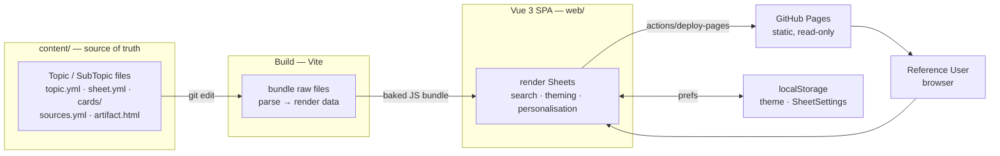
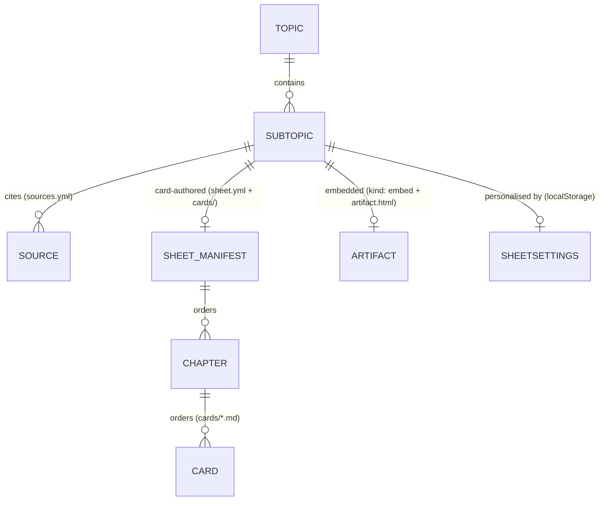

# CheatSheets — High-Level Design Document (Master)

> A personal CheatSheet web application that turns studied material into information-dense, spatially-stable single-page reference Sheets optimised for photographic recall, authored as content-as-code and deployed as a static site on GitHub Pages.

# Version Log

| Version | Author        | Date       | Comment                                                        |
|---------|---------------|------------|----------------------------------------------------------------|
| v1.0    | Erick Venneri | 2026-06-02 | Master — migration: initial HLDD from anchored-specs + design  |
| v1.1    | Erick Venneri | 2026-06-22 | Content/View — Spec: Embedded Sheet SubTopic (US-embed-*)      |
| v1.2    | Erick Venneri | 2026-06-22 | View — Design: Embedded Sheet iframe render + search bridge    |
| v1.3    | Erick Venneri | 2026-06-26 | Content/View — Spec+Design: Embedded Sheet sources.yml         |
| v2.0    | Erick Venneri | 2026-07-08 | Master — migration: adopt v2.1.2 layout, dissolve Content ctx  |

# Table of Contents

- [1. Introduction](#1-introduction)
  - [1.1 Context](#11-context)
  - [1.2 Proposal](#12-proposal)
- [2. Cross-cutting Assumptions](#2-cross-cutting-assumptions)
  - [2.1 User Roles](#21-user-roles)
  - [2.2 External System Assumptions](#22-external-system-assumptions)
  - [2.3 Contexts](#23-contexts)
- [3. Architecture](#3-architecture)
  - [3.1 Content-as-code](#31-content-as-code)
  - [3.2 Theming](#32-theming)
  - [3.3 Hash routing](#33-hash-routing)
  - [3.4 User-side rendering preferences](#34-user-side-rendering-preferences)
  - [3.5 Dependency constraint](#35-dependency-constraint)
  - [3.6 Embedded Sheet isolation](#36-embedded-sheet-isolation)
- [4. Data Model](#4-data-model)
  - [4.1 Content entities](#41-content-entities)
  - [4.2 Runtime settings store](#42-runtime-settings-store)
- [5. API](#5-api)
- [6. Frontend](#6-frontend)
- [7. Procedures](#7-procedures)
  - [7.1 Authoring lifecycle](#71-authoring-lifecycle)
  - [7.2 Generating a Sheet from Sources](#72-generating-a-sheet-from-sources)
  - [7.3 Creating an Embedded Sheet](#73-creating-an-embedded-sheet)
  - [7.4 Migrating an existing Embedded Sheet](#74-migrating-an-existing-embedded-sheet)
  - [7.5 Removing a CheatSheet or Sheet](#75-removing-a-cheatsheet-or-sheet)
- [8. Infrastructure](#8-infrastructure)
  - [8.1 Local Environment](#81-local-environment)
  - [8.2 Development Environment](#82-development-environment)
  - [8.3 Production Environment](#83-production-environment)

# 1. Introduction

## 1.1 Context

The User has a photographic memory and studies best from single-page, information-dense reference material with strong, stable spatial structure. Existing documentation and note tools optimise for completeness or linear reading, not for relocating a previously-seen fact by its position on a page. The User needs one place to hold their learning journey — optimised for photographic recall and reachable from any device.

## 1.2 Proposal

### 1.2.1 Goal

The Solution has two Goals, both of which must be met:

- **Learning Consolidation** — provide a comprehensive overview of a studied topic so the User can grasp, in one glance, the key concepts they have already learned, leaning on photographic memory.
- **Learning Retention** — serve as a reference to look up a specific fact about a topic without wading back through the original documentation or resources.

### 1.2.2 In Scope

- Authoring Sheets as **content-as-code** — Markdown + YAML files under `content/`, bundled at build time.
- Rendering each studied SubTopic as a single-page, information-dense Sheet with a stable spatial layout.
- Two Sheet kinds: **card-authored** (table / code / text cards grouped into Chapters) and **embedded** (a self-contained HTML artifact rendered as-is).
- Per-user, per-Chapter rendering personalisation (font sizes, columns, layout, collapse) and per-Sheet page width, persisted locally.
- Light / Dark theming that follows the OS on first visit and persists the User's explicit choice.
- In-Sheet search: highlight every match in place; keep non-matching cards' size but blank their body.
- Small-screen read-only rendering (single column, controls hidden).
- Per-Sheet Source attribution footer.

### 1.2.3 Out of Scope

- **Completeness of information** — a Sheet is comprehensive of what the User has already studied, not of the whole topic.
- **No backend** — no authentication, no multi-user, no server-side persistence.
- **No runtime content editing** — all mutation flows through local file edits and `git push`; the deployed app is read-only.
- **No preview or staging environment** — the small personal scope justifies the simplicity.

### 1.2.4 Deliverables

- A static site deployed on GitHub Pages.
- The content-as-code authoring format (§4) and its authoring procedures (§7).

# 2. Cross-cutting Assumptions

## 2.1 User Roles

| Role               | Definition                                                                                                                                                                                            |
|--------------------|-------------------------------------------------------------------------------------------------------------------------------------------------------------------------------------------------------|
| Consolidation User | The User acting to build or extend a CheatSheet: selecting Topics and SubTopics, gathering Sources, and producing the material from which a Sheet is generated. Exercised through the authoring Procedures (§7). |
| Reference User     | The User acting to consume an already-built CheatSheet: opening it, navigating between its Sheets, and using photographic recall to retrieve previously-studied information. The subject of the View Context (§2.3). |

The Consolidation User and the Reference User are the same human in different roles — building versus consuming — carried out at different times.

## 2.2 External System Assumptions

- **GitHub Pages** — static hosting only. No authentication, no backend, no database. The deployed app is read-only; all mutation flows through local file edits and `git push`.
- **Browser `localStorage`** — assumed available for persisting theme and per-Sheet rendering preferences. When it is blocked or unavailable (e.g. private browsing), the app degrades gracefully for the current session rather than failing (see `view/` `US-dark-mode`).

## 2.3 Contexts

Only one Context remains. Content authoring is **not** a Context — it is the process by which the site's material is produced, captured as the data model (§4) and the authoring procedures (§7), not as a set of features.

| Context | Sub-document                 | Covers                                                                                                          |
|---------|------------------------------|-----------------------------------------------------------------------------------------------------------------|
| View    | [view/view.md](view/view.md) | What the User sees and navigates — rendered Sheets, personalisation, theming, in-Sheet search, embedded artifacts. |

# 3. Architecture

The application has no application layer: `content/` acts as the data layer (single source of truth), the `web/` Vue app is the presentation layer, and there is no server in between. Content files are read at build time, parsed, and baked into the JavaScript bundle; the bundle is deployed as static files and personalises itself per-browser via `localStorage`.



## 3.1 Content-as-code

Sheets are authored as Markdown + YAML under `content/` and bundled at build time — no runtime fetching, no CMS, no database. The content format (§4) is the stable contract between authoring and rendering: the format leads, the parser and renderer follow. A feature that seems to need a new section type or manifest field is a format amendment first.

## 3.2 Theming

Light and Dark themes resolve through CSS custom properties toggled by a single class on `<html>` — no per-component dark variants; every colour flips globally when the class changes. First visit follows the OS preference and tracks live OS changes until the User explicitly toggles; the choice then persists to `localStorage` and overrides the OS signal. A synchronous inline script in `index.html` sets the class before the stylesheet loads, preventing a flash of the wrong theme (FOUC). The palette lives in `web/src/index.css`.

## 3.3 Hash routing

Hash routing (`#/topic/subtopic`) is deliberate: GitHub Pages serves static files only, so without it every deep link would 404 unless a `404.html` SPA fallback were wired up. Hash URLs sidestep that with no extra configuration. Routes are defined in `web/src/router.js`.

## 3.4 User-side rendering preferences

Per-Chapter rendering settings (font sizes, column count, layout type, collapsed state) and per-Sheet page max-width are stored in `localStorage`, not in content files. This keeps the content format clean and lets the Reference User personalise the view without touching authored content. Settings survive navigation and reloads; the small-screen breakpoint temporarily overrides them without erasing the stored values. The store lives in `web/src/store.js`; the persisted shape is defined in §4.2.

## 3.5 Dependency constraint

No runtime dependencies beyond the existing set (Vue, vue-router). The bundle must stay free of Node-oriented libraries — the in-repo YAML parser (`web/src/lib/yaml.js`) exists precisely because `js-yaml` and `gray-matter` throw `Buffer is not defined` in the browser. Adding a new runtime dependency requires a design amendment, not a silent install.

## 3.6 Embedded Sheet isolation

An Embedded Sheet renders its `artifact.html` verbatim inside a same-origin `<iframe srcdoc>`, giving full CSS *and* JavaScript isolation: the artifact appears exactly as it does standalone, unaffected by — and unable to affect — the app's styles or theme. The mechanism is deliberate: artifacts (typically generated in Claude Code sessions) are dropped in unaltered.

- **No `sandbox` attribute** — same-origin access is required so the app can read the frame's document for auto-height and in-Sheet search. Artifacts are first-party, trusted content; the trade-off is that artifact JavaScript runs with the page's origin.
- **Auto-height** — a parent-side `ResizeObserver` sets the iframe height to its content, so the page scrolls naturally with no inner scrollbar; nothing is injected into the artifact.
- **In-Sheet search reaches inside** — on the frame's `load`, a `TreeWalker` wraps matches in `<mark class="search-hit">`, cleared when the query empties. There is no card-blanking — an Embedded Sheet has no cards.
- **No new runtime dependency** — `<iframe srcdoc>`, `ResizeObserver`, and `TreeWalker` are native browser APIs (per §3.5).

**Authoring contract:** an artifact must be fully self-contained (inline CSS / JS / assets). `srcdoc`'s base URL is `about:srcdoc`, so relative asset URLs do not resolve and outbound links break — Source/reference links therefore belong in `sources.yml`, never inside the artifact. Rendering lives in `web/src/components/EmbeddedArtifact.vue`; see [view/view.md](view/view.md) `US-embed-view`.

# 4. Data Model

The application has no relational database. Its data model has two parts: the **file-system content model** under `content/` (the authored source of truth, bundled at build time) and the **runtime settings store** in `localStorage` (per-user rendering preferences). Every entity cited by an Acceptance Criterion is defined here, and only here; per-Story Data Model sections link back to these definitions rather than repeating them.



A SubTopic is card-authored **or** embedded, never both: it carries either a `sheet.yml` manifest with a `cards/` directory, or a `sheet.yml` with `kind: embed` and an `artifact.html`.

## 4.1 Content entities

| Entity            | File-system artifact                                                                      | Notes                                                                            |
|-------------------|-------------------------------------------------------------------------------------------|----------------------------------------------------------------------------------|
| Topic             | `content/<topic>/topic.yml`                                                                | Slug = folder name. Same underlying thing as a `CheatSheet` in the View Context. |
| SubTopic          | `content/<topic>/<subtopic>/`                                                              | Slug = `<topic>/<subtopic>`. Maps 1:1 to a `Sheet`.                              |
| Source            | An entry in `content/<topic>/<subtopic>/sources.yml`                                       | External resource consulted to produce the Sheet.                               |
| Sheet (manifest)  | `content/<topic>/<subtopic>/sheet.yml` + `cards/*.md`                                      | Card-authored variant: manifest + one Markdown file per card.                   |
| Artifact SubTopic | `content/<topic>/<subtopic>/sheet.yml` (`kind: embed`) + `artifact.html` + `sources.yml`  | Embedded variant: a self-contained HTML page rendered as-is; no `cards/`.        |
| CheatSheet        | The set of SubTopic directories under one `content/<topic>/`                               | Synthesised at load time; not a stored artifact.                                |

**Topic — `topic.yml`**

```yaml
title: Python                       # display name
subtitle: language reference across versions
default: "3.14"                     # SubTopic slug rendered when /<topic> is opened
```

All keys optional. With no `default`, the loader picks the lexicographically last SubTopic (so version-named SubTopics open on the newest).

**SubTopic (card-authored) — `sheet.yml`**

The manifest carries display metadata and an ordered list of Chapters, each with an ordered list of card ids; each id `foo` resolves to `cards/foo.md`.

```yaml
title: Django
subtitle: "basics"

chapters:
  - title: Project
    id: project              # optional; defaults to slug(title)
    cards:
      - project-anatomy      # card id == filename (without .md) under cards/
      - cli
  - title: Request cycle
    cards:
      - urls
      - views
```

- `title` / `subtitle` are scalar strings.
- `chapters` is ordered; each Chapter has an optional `title`, optional `id`, and a required ordered `cards` list. The chapterless case is a single Chapter with no `title` (rendered with no rail/divider).
- Card ids are slugified display titles. A missing `cards/<id>.md`, an id used twice, or a header/filename mismatch each produces a console warning; a file on disk but not in the manifest is ignored.

> The exact slugification algorithm, the fixed indent levels the in-repo YAML helper accepts, and every warning condition are implemented in `web/src/lib/parseCheatsheet.js`, `web/src/lib/assembleSheet.js`, and `web/src/lib/yaml.js` — the code is authoritative for the algorithm; this section is authoritative for the contract.

**Artifact SubTopic — `sheet.yml` (`kind: embed`)**

Replaces `cards/` with a single self-contained HTML artifact; the manifest carries display metadata only — no `chapters`.

```yaml
title: Some Artifact
subtitle: "as built"
kind: embed
```

- `kind: embed` marks the SubTopic as an Artifact SubTopic; its absence (with a `chapters:` manifest + `cards/` directory) is the default card-authored Sheet.
- An `artifact.html` must sit alongside; it is rendered as-is in an isolated style scope (§3.6) and must contain no outbound Source links — all attribution lives in `sources.yml`.

**Source — `sources.yml`**

One `sources.yml` per SubTopic lists the Sources consulted; the app renders them as a footer on each Sheet.

```yaml
sources:
  - title: What's New In Python 3.14
    url: https://docs.python.org/3/whatsnew/3.14.html
    type: doc                       # doc | article | rfc | pep | video | pdf | other
    fetched: 2026-04-18             # ISO date, no time
    read_as: authoritative — drive the Sheet's structure from this   # optional
```

| Field     | Required | Notes                                                                                              |
|-----------|----------|----------------------------------------------------------------------------------------------------|
| `title`   | yes      | Display name of the Source.                                                                        |
| `url`     | yes      | Absolute URL, or a repo-relative path for local files (e.g. a PDF alongside `sources.yml`).        |
| `type`    | yes      | One of `doc`, `article`, `rfc`, `pep`, `video`, `pdf`, `other`.                                    |
| `fetched` | yes      | Date the Source was last consulted. ISO format.                                                    |
| `read_as` | no       | One line on *how* to read this Source when producing the Sheet: what to extract, skip, its role.   |

**Card — `cards/<id>.md`**

Each card file holds exactly one section, no frontmatter — all metadata lives in the section header and in `sheet.yml`. The header is an `H2`, optionally tagged with a renderer type and trailing attributes:

```
## [TYPE ID] Display Title {key: value}
```

- `TYPE` — `table` (default), `code`, or `text`.
- `ID` — optional stable DOM id / search anchor; defaults to the slugified title.
- `{...}` — optional attributes: `accent` (card top-border colour — semantic `status-2xx…5xx`, `neutral`, or a hex) and `span: full` (span all columns in a `columns` Chapter).
- **Callouts** — blockquotes prefixed with a tag (`> [tip] …`, `> [warn] …`) attach to the preceding section and render below its body.

The three card types:

- **`table`** — a titled box with rows. Columns `code` (mono/bold), `name` (semibold), `desc` (muted), `detail` (muted sub-row spanning full width); non-standard columns render as extra muted text. Cells accept inline Markdown only; escape a literal pipe as `\|`.
- **`code`** — snippets where the *shape* is the memory anchor. A section is a sequence of blocks, each optionally: a `### sub-heading`, a **preface** (prose before the fence), a fenced block with an optional filename token (renders as a file-tab), and a **caption** (prose after the fence, in a `why` callout). **Golden rule — preface → code → caption:** the preface says what the snippet shows, inline comments carry per-line detail, the caption is reserved for gotchas. Never code-first.
- **`text`** — short formatted prose: `**bold**`, `*em*`, `` `code` ``, `[links](url)`, and bullet lists.

Chapter layout (`columns` vs `vertical`), font sizes, and column count are **not** authored here — they are runtime Sheet settings (§4.2). The parser strips any legacy `{type: …}` attribute on `[chapter]` headers.

## 4.2 Runtime settings store

Rendering preferences are persisted per Sheet in `localStorage` under `cheatsheet:settings:<topic>/<subtopic>`; they are not part of any content file. The shape:

```ts
type SheetSettings = {
  maxWidth: number                                   // page width — Sheet-scoped
  chapters: Record<string, Partial<ChapterSettings>> // per-Chapter overrides, keyed by chapter id ('' = implicit chapter)
}

type ChapterSettings = {
  bodySize: number
  cardTitleSize: number
  chapterTitleSize: number
  cols: number                  // 1..6
  type: 'vertical' | 'columns'
  collapsed: boolean            // default true
}
```

Resolution at render time is two-tier: **per-Chapter override → hard-coded `CHAPTER_DEFAULTS`**. `maxWidth` is applied as a `--page-max` custom property on `:root`; the Chapter-scoped fields as inline custom properties on each Chapter's `<section>`. Theme preference is persisted separately under its own key. The store, the defaults, the small-screen override, and the migration of older persisted shapes are all owned by `web/src/store.js` — the code is authoritative for the migration rules.

# 5. API

> _Not applicable — the deployed app is a static site with no backend API._

# 6. Frontend

| Layer     | Choice                                                                             |
|-----------|------------------------------------------------------------------------------------|
| Build     | Vite 5                                                                             |
| Framework | Vue 3 Composition API                                                              |
| Routing   | vue-router 4, hash mode (§3.3)                                                     |
| Styling   | Tailwind CSS 3 (`darkMode: 'class'`), `@tailwind` layers in `web/src/index.css`   |
| Parsing   | In-repo YAML + Markdown helpers under `web/src/lib/` (no Node-oriented libs — §3.5) |

The Vue app lives in `web/`. Per-Story Frontend pointer sections (in `view/user-stories/`) cite the specific pages and components they involve; the components themselves live under `web/src/pages/` and `web/src/components/`.

# 7. Procedures

The authoring lifecycle is a process carried out by the Consolidation User together with the Agent, not a product feature. It is captured here as procedures rather than as User Stories.

## 7.1 Authoring lifecycle

Content is authored as code (§3.1): the Consolidation User edits files under `content/`, previews locally (§8.1), and `git push`es to deploy (§8.3). There is no runtime editing surface.

## 7.2 Generating a Sheet from Sources

The iterative process — **Generation** — by which the Consolidation User and the Agent produce or refresh a Sheet from its Sources. Each Generation may span multiple rounds of review and revision until the User accepts the result.

1. **Create the Topic** (if new) — add `content/<topic>/topic.yml`. An empty Topic contains no Sheets yet.
2. **Assemble Sources** — add `content/<topic>/<subtopic>/sources.yml` per the schema in §4.1.
3. **Generate the Sheet** — the Agent produces `sheet.yml` + `cards/*.md` from the Sources, conforming to the card format in §4.1.
4. **Refresh on change** — when the Sources change, update `sources.yml` and re-run the Generation; the Sheet is regenerated from the updated set.

## 7.3 Creating an Embedded Sheet

When the Consolidation User adds an Artifact SubTopic:

1. **Produce `artifact.html`** — self-contained HTML (inline CSS / JS / assets). No outbound Source/reference links; all attribution externalised to `sources.yml`.
2. **Create `sources.yml`** — one entry per Source consulted, per §4.1.
3. **Create `sheet.yml`** — `title`, `subtitle`, `kind: embed`; no `chapters`.
4. **Place all three** in `content/<topic>/<subtopic>/`.

## 7.4 Migrating an existing Embedded Sheet

When an existing Artifact SubTopic has Source links baked into its `artifact.html` and no `sources.yml`:

1. **Extract Sources** — identify every outbound Source/reference link in the artifact.
2. **Create `sources.yml`** — one entry per extracted Source, per §4.1.
3. **Strip Source links from `artifact.html`** — so all attribution flows through the app's Sources footer.

## 7.5 Removing a CheatSheet or Sheet

Removal is a file operation: delete the SubTopic directory to remove a single Sheet (its `sheet.yml`, `cards/`/`artifact.html`, and `sources.yml` go with it), or delete the Topic directory to remove the whole CheatSheet. The remaining Sheets are unaffected; a removed Topic is no longer listed after the next build.

# 8. Infrastructure

## 8.1 Local Environment

Run `npm install` then `npm run dev` inside `web/`. The dev server serves the app at `localhost:5173` with hot reload; content changes under `content/` are picked up on the next refresh (Vite re-bundles the raw files). No database, no backend services, no environment variables.

## 8.2 Development Environment

There is no hosted development or staging environment. `dev` is the integration branch where Sheets are authored and reviewed; `main` is the deploy target only. Work is done against `dev` and promoted to `main` to publish. The small personal scope justifies the absence of a separate hosted tier.

## 8.3 Production Environment

Push to `main` triggers a GitHub Actions workflow (`.github/workflows/deploy.yml`) that builds the app and deploys to GitHub Pages via `actions/deploy-pages` — no `gh-pages` branch, no manual upload. The deployed site is static and read-only; hash routing (§3.3) avoids deep-link 404s without a `404.html` fallback.
