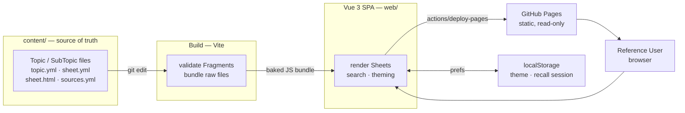
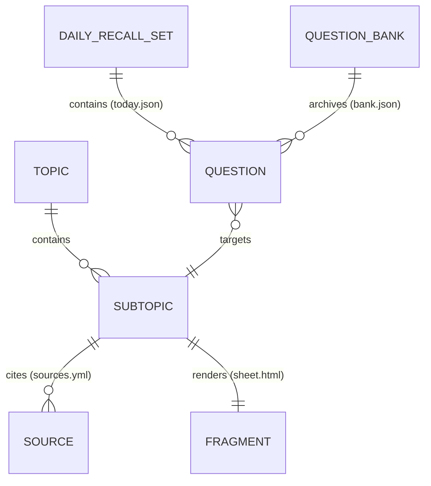

# CheatSheets — High-Level Design Document (Master)

> A personal CheatSheet web application that turns studied material into information-dense, spatially-stable single-page reference Sheets optimised for photographic recall, authored as content-as-code and deployed as a static site on GitHub Pages.

# Version Log

The append-only version table lives in [changelog.md](changelog.md). Open Questions and the Improvements Backlog live in [open-issues.md](open-issues.md).

# Table of Contents

- [1. Introduction](#1-introduction)
  - [1.1 Context](#11-context)
  - [1.2 Proposal](#12-proposal)
- [2. Cross-cutting Assumptions](#2-cross-cutting-assumptions)
  - [2.1 User Roles](#21-user-roles)
  - [2.2 External System Assumptions](#22-external-system-assumptions)
  - [2.3 Contexts](#23-contexts)
- [3. Architecture](#3-architecture)
  - [3.1 Content-as-code](#31-content-as-code)
  - [3.2 Theming](#32-theming)
  - [3.3 Hash routing](#33-hash-routing)
  - [3.4 Dependency constraint](#34-dependency-constraint)
  - [3.5 Sheet Fragment contract](#35-sheet-fragment-contract)
- [4. Data Model](#4-data-model)
  - [4.1 Content entities](#41-content-entities)
  - [4.2 Runtime settings store](#42-runtime-settings-store)
- [5. API](#5-api)
- [6. Frontend](#6-frontend)
- [7. Procedures](#7-procedures)
  - [7.1 Authoring lifecycle](#71-authoring-lifecycle)
  - [7.2 Generating a Sheet from Sources](#72-generating-a-sheet-from-sources)
  - [7.3 Removing a CheatSheet or Sheet](#73-removing-a-cheatsheet-or-sheet)
  - [7.4 Generating Daily Recall questions](#74-generating-daily-recall-questions)
- [8. Infrastructure](#8-infrastructure)
  - [8.1 Local Environment](#81-local-environment)
  - [8.2 Development Environment](#82-development-environment)
  - [8.3 Production Environment](#83-production-environment)

# 1. Introduction

## 1.1 Context

The User has a photographic memory and studies best from single-page, information-dense reference material with strong, stable spatial structure. Existing documentation and note tools optimise for completeness or linear reading, not for relocating a previously-seen fact by its position on a page. The User needs one place to hold their learning journey — optimised for photographic recall and reachable from any device.

## 1.2 Proposal

### 1.2.1 Goal

The Solution has two Goals, both of which must be met:

- **Learning Consolidation** — provide a comprehensive overview of a studied topic so the User can grasp, in one glance, the key concepts they have already learned, leaning on photographic memory.
- **Learning Retention** — serve as a reference to look up a specific fact about a topic without wading back through the original documentation or resources.

### 1.2.2 In Scope

- Authoring Sheets as **content-as-code** — HTML Fragments + YAML files under `content/`, bundled at build time.
- Rendering each studied SubTopic as a single-page, information-dense Sheet with a stable spatial layout.
- One Sheet format: a semantic HTML **Fragment** rendered as a native page in the site's design system (§3.5).
- Light / Dark theming that follows the OS on first visit and persists the User's explicit choice; Sheet content follows the theme.
- In-Sheet search: highlight every match in place.
- Small-screen read-only rendering (single column, controls hidden).
- Per-Sheet Source attribution footer.

### 1.2.3 Out of Scope

- **Completeness of information** — a Sheet is comprehensive of what the User has already studied, not of the whole topic.
- **No backend** — no authentication, no multi-user, no server-side persistence.
- **No runtime content editing** — all mutation flows through local file edits and `git push`; the deployed app is read-only.
- **No preview or staging environment** — the small personal scope justifies the simplicity.

### 1.2.4 Deliverables

- A static site deployed on GitHub Pages.
- The content-as-code authoring format (§4) and its authoring procedures (§7).

# 2. Cross-cutting Assumptions

## 2.1 User Roles

| Role               | Definition                                                                                                                                                                                            |
|--------------------|-------------------------------------------------------------------------------------------------------------------------------------------------------------------------------------------------------|
| Consolidation User | The User acting to build or extend a CheatSheet: selecting Topics and SubTopics, gathering Sources, and producing the material from which a Sheet is generated. Exercised through the authoring Procedures (§7). |
| Reference User     | The User acting to consume an already-built CheatSheet: opening it, navigating between its Sheets, and using photographic recall to retrieve previously-studied information. The subject of the View Context (§2.3). |

The Consolidation User and the Reference User are the same human in different roles — building versus consuming — carried out at different times.

## 2.2 External System Assumptions

- **GitHub Pages** — static hosting only. No authentication, no backend, no database. The deployed app is read-only; all mutation flows through local file edits and `git push`.
- **Browser `localStorage`** — assumed available for persisting the theme preference and Daily Recall session progress. When it is blocked or unavailable (e.g. private browsing), the app degrades gracefully for the current session rather than failing (see `view/` `US-dark-mode`).

## 2.3 Contexts

Content authoring is **not** a Context — it is the process by which the site's material is produced, captured as the data model (§4) and the authoring procedures (§7), not as a set of features.

| Context   | Sub-document                             | Covers                                                                                                          |
|-----------|------------------------------------------|-----------------------------------------------------------------------------------------------------------------|
| View      | [view/view.md](view/view.md)             | What the User sees and navigates — rendered Sheets, theming, in-Sheet search. |
| Retention | [retention/retention.md](retention/retention.md) | Active reinforcement of studied material — daily questions that test recall across all topics.                   |

# 3. Architecture

The application has no application layer: `content/` acts as the data layer (single source of truth), the `web/` Vue app is the presentation layer, and there is no server in between. Content files are read at build time, parsed, and baked into the JavaScript bundle; the bundle is deployed as static files and personalises itself per-browser via `localStorage`.


```mermaid
flowchart LR
    subgraph authoring["content/ — source of truth"]
        C["Topic / SubTopic files<br/>topic.yml · sheet.yml<br/>sheet.html · sources.yml"]
    end
    subgraph build["Build — Vite"]
        B["validate Fragments<br/>bundle raw files"]
    end
    subgraph app["Vue 3 SPA — web/"]
        A["render Sheets<br/>search · theming"]
    end
    H["GitHub Pages<br/>static, read-only"]
    U["Reference User<br/>browser"]
    LS["localStorage<br/>theme · recall session"]

    C -->|git edit| B
    B -->|baked JS bundle| A
    A -->|actions/deploy-pages| H
    H --> U
    U --> A
    A <-->|prefs| LS
```

## 3.1 Content-as-code

Sheets are authored as HTML Fragments + YAML under `content/` and bundled at build time — no runtime fetching, no CMS, no database. The content format (§4) is the stable contract between authoring and rendering: the format leads, the validator and renderer follow. A feature that seems to need a new vocabulary element or manifest field is a format amendment first.

## 3.2 Theming

Light and Dark themes resolve through CSS custom properties toggled by a single class on `<html>` — no per-component dark variants; every colour flips globally when the class changes. First visit follows the OS preference and tracks live OS changes until the User explicitly toggles; the choice then persists to `localStorage` and overrides the OS signal. A synchronous inline script in `index.html` sets the class before the stylesheet loads, preventing a flash of the wrong theme (FOUC). The palette lives in `web/src/index.css`.

## 3.3 Hash routing

Hash routing (`#/topic/subtopic`) is deliberate: GitHub Pages serves static files only, so without it every deep link would 404 unless a `404.html` SPA fallback were wired up. Hash URLs sidestep that with no extra configuration. Routes are defined in `web/src/router.js`.

## 3.4 Dependency constraint

No runtime dependencies beyond the existing set (Vue, vue-router). The bundle must stay free of Node-oriented libraries — the in-repo YAML parser (`web/src/lib/yaml.js`) exists precisely because `js-yaml` and `gray-matter` throw `Buffer is not defined` in the browser. Adding a new runtime dependency requires a design amendment, not a silent install.

## 3.5 Sheet Fragment contract

A Sheet's body is a **Fragment** (`sheet.html`): semantic HTML written in the fixed vocabulary defined in §4.1, rendered inline as part of the application page — no isolation boundary. The Fragment carries structure and content only; the site owns everything else:

- **Styling** — one site-owned stylesheet styles the vocabulary through the theme custom properties (§3.2), so every Sheet shares the site's design system and follows Light / Dark. A Fragment declares no styles and no colours of its own.
- **Behaviour** — the renderer derives the Table of Contents from the Fragment's sections, owns scroll-spy and in-page anchor scrolling (compatible with hash routing, §3.3), and applies in-Sheet search highlighting directly to the rendered content. A Fragment contains no scripts.
- **Validation** — a build-time validator rejects any Fragment outside the contract: disallowed elements or classes, `<style>` / `<script>` tags, or external resource references. The exhaustive allow-list is validator-owned — the code is authoritative for the list; this section is authoritative for the contract.

Source/reference links belong in `sources.yml`, never inside the Fragment — attribution renders through the app's Sources footer. See [view/view.md](view/view.md) `US-page-view`.

# 4. Data Model

The application has no relational database. Its data model has two parts: the **file-system content model** under `content/` (the authored source of truth, bundled at build time) and the **runtime settings store** in `localStorage` (theme preference and Daily Recall session progress). Every entity cited by an Acceptance Criterion is defined here, and only here; per-Story Data Model sections link back to these definitions rather than repeating them.


```mermaid
erDiagram
    TOPIC ||--o{ SUBTOPIC : contains
    SUBTOPIC ||--o{ SOURCE : "cites (sources.yml)"
    SUBTOPIC ||--|| FRAGMENT : "renders (sheet.html)"
    DAILY_RECALL_SET ||--o{ QUESTION : "contains (today.json)"
    QUESTION_BANK ||--o{ QUESTION : "archives (bank.json)"
    QUESTION }o--|| SUBTOPIC : "targets"
```

Every SubTopic carries the same three files: a `sheet.yml` manifest (display metadata), a `sheet.html` Fragment (the Sheet's body), and a `sources.yml` (attribution).

## 4.1 Content entities

| Entity            | File-system artifact                                                                      | Notes                                                                            |
|-------------------|-------------------------------------------------------------------------------------------|----------------------------------------------------------------------------------|
| Topic             | `content/<topic>/topic.yml`                                                                | Slug = folder name. Same underlying thing as a `CheatSheet` in the View Context. |
| SubTopic          | `content/<topic>/<subtopic>/`                                                              | Slug = `<topic>/<subtopic>`. Maps 1:1 to a `Sheet`.                              |
| Source            | An entry in `content/<topic>/<subtopic>/sources.yml`                                       | External resource consulted to produce the Sheet.                               |
| Sheet manifest    | `content/<topic>/<subtopic>/sheet.yml`                                                     | Display metadata: `title`, `subtitle`.                                          |
| Fragment          | `content/<topic>/<subtopic>/sheet.html`                                                    | The Sheet's body: semantic HTML in the fixed vocabulary (below); no styling, no scripts. |
| CheatSheet        | The set of SubTopic directories under one `content/<topic>/`                               | Synthesised at load time; not a stored artifact.                                |
| Daily Recall set  | `content/recall/today.json`                                                                | 10 questions targeting existing SubTopics; replaced daily by the generation routine (§7.4). |
| Question          | An entry in `content/recall/today.json` → `questions[]`                                    | One multiple-choice question: `id`, `topic`, `subtopic`, `question`, `choices` (4), `answer` (zero-indexed), `explanation`. |
| Question Bank     | `content/recall/bank.json`                                                                 | Append-only archive of every Question that has shipped in a Daily Recall set; read by the generation routine (§7.4) to avoid re-asking. Not loaded by the web app. |

**Topic — `topic.yml`**

```yaml
title: Python                       # display name
subtitle: language reference across versions
default: "3.14"                     # SubTopic slug rendered when /<topic> is opened
```

All keys optional. With no `default`, the loader picks the lexicographically last SubTopic (so version-named SubTopics open on the newest).

**Sheet manifest — `sheet.yml`**

Display metadata only:

```yaml
title: React Basics
subtitle: "a field guide"
```

Both keys are scalar strings; no other keys.

**Fragment — `sheet.html`**

The Sheet's body: semantic HTML written in a fixed vocabulary, carrying structure and content only — the site styles and animates it (§3.5). Body markup exclusively: no `<html>`/`<head>`/`<body>` skeleton, no `<style>`, no `<script>`, no external resources, no inline `style` attributes, no colours.

| Element | Purpose |
|---------|---------|
| `<section id="…">` with one `<h2>` | One titled section — the unit of the Table of Contents, anchor navigation, and spatial recall. Ids unique within the Fragment. |
| `<h3>` | Sub-heading within a section. |
| `<p>`, `<ul>`, `<ol>` | Prose and lists; inline `<strong>`, `<em>`, `<code>`, `<a>` allowed. |
| `<div class="tbl">` + `<table>` | A data table inside its horizontal-scroll wrapper. |
| `<div class="code">` + `<pre><code>` | A code block; optional `<span class="label">` file-tab label. |
| `<figure class="diagram">` + inline `<svg>` | A diagram; shapes use the vocabulary's theme classes, never literal colours. |
| `<div class="flow">` | A horizontal step-flow of boxed items. |
| `<div class="note">` | A neutral emphasis box for a load-bearing remark that must stand apart from the body flow; optional `<span class="label">` lead. |
| `<div class="cols">` | A multi-column group of blocks; stacks to a single column on small screens. |

> The exhaustive allow-list of elements, classes, and attributes is enforced by the build-time validator (`web/scripts/validate-fragments.mjs`) — the code is authoritative for the list; this section is authoritative for the contract.

**Source — `sources.yml`**

One `sources.yml` per SubTopic lists the Sources consulted; the app renders them as a footer on each Sheet.

```yaml
sources:
  - title: What's New In Python 3.14
    url: https://docs.python.org/3/whatsnew/3.14.html
    type: doc                       # doc | article | rfc | pep | video | pdf | other
    fetched: 2026-04-18             # ISO date, no time
    read_as: authoritative — drive the Sheet's structure from this   # optional
```

| Field     | Required | Notes                                                                                              |
|-----------|----------|----------------------------------------------------------------------------------------------------|
| `title`   | yes      | Display name of the Source.                                                                        |
| `url`     | yes      | Absolute URL, or a repo-relative path for local files (e.g. a PDF alongside `sources.yml`).        |
| `type`    | yes      | One of `doc`, `article`, `rfc`, `pep`, `video`, `pdf`, `other`.                                    |
| `fetched` | yes      | Date the Source was last consulted. ISO format.                                                    |
| `read_as` | no       | One line on *how* to read this Source when producing the Sheet: what to extract, skip, its role.   |

**Daily Recall set — `content/recall/today.json`**

A single JSON file containing the day's 10 questions. Overwritten daily by the generation routine (§7.4); shipped questions are archived in the Question Bank (below).

```json
{
  "generated": "2026-07-19",
  "questions": [
    {
      "id": "2026-07-19-01",
      "topic": "django",
      "subtopic": "basics-v2",
      "question": "What does transaction.atomic do when an inner block raises?",
      "choices": ["Commits the outer transaction", "Rolls back to the savepoint", "Silently swallows the error", "Retries the block three times"],
      "answer": 1,
      "explanation": "Inner atomic blocks create savepoints. An exception rolls back to that savepoint, not the entire transaction."
    }
  ]
}
```

| Field         | Type     | Notes                                                      |
|---------------|----------|-------------------------------------------------------------|
| `generated`   | ISO date | Date the set was created. Used to detect staleness.         |
| `questions`   | array    | Exactly 10 entries.                                         |
| `id`          | string   | `YYYY-MM-DD-NN`. Unique per question within a day.         |
| `topic`       | string   | Topic slug — matches `content/<topic>/`.                    |
| `subtopic`    | string   | SubTopic slug — matches `content/<topic>/<subtopic>/`.      |
| `question`    | string   | The question text.                                          |
| `choices`     | string[] | Exactly 4 options.                                          |
| `answer`      | integer  | Zero-indexed index into `choices`.                          |
| `explanation` | string   | One or two sentences on why the correct answer is correct.  |

**Question Bank — `content/recall/bank.json`**

The append-only archive of every Question that has shipped in a Daily Recall set:

```json
{
  "questions": [ ]
}
```

Entries are exact copies of shipped `Question` entries (schema above), appended in generation order — the `id` date prefix encodes when each shipped. The bank holds no duplicates: within a SubTopic, no two entries ask the same fact from the same angle (enforced by the generation routine, §7.4). Entries whose SubTopic has since been removed stay in the bank harmlessly; the routine only consults entries for the SubTopics it picks. The web app does not load the bank.

## 4.2 Runtime settings store

The store holds per-browser, non-content state only: the theme preference (persisted under its own `localStorage` key) and Daily Recall session progress. There are no rendering preferences. The store lives in `web/src/store.js` — the code is authoritative for the cleanup of any previously persisted shapes.

Daily Recall session progress is persisted under `recall:<generated-date>`:

```ts
type RecallSession = {
  current: number       // index of the next unanswered question (0–9)
  answers: (number | null)[]  // user's chosen index per question, null if unanswered
}
```

On load, the app compares the `generated` date in `today.json` with the localStorage key. If they match, the session resumes from `current`. If they differ (new day's set deployed), the stale key is cleared and the session starts fresh.

# 5. API

> _Not applicable — the deployed app is a static site with no backend API._

# 6. Frontend

| Layer           | Choice                                                                             |
|-----------------|------------------------------------------------------------------------------------|
| Build           | Vite 5                                                                             |
| Framework       | Vue 3 Composition API                                                              |
| Routing         | vue-router 4, hash mode (§3.3)                                                     |
| Styling         | Tailwind CSS 3 (`darkMode: 'class'`), `@tailwind` layers in `web/src/index.css`   |
| Sheet rendering | `web/src/components/SheetFragment.vue` + the vocabulary stylesheet `web/src/styles/sheet.css` (§3.5) |
| Validation      | `web/scripts/validate-fragments.mjs`, wired into the build (§3.5)                  |
| Parsing         | In-repo YAML helper under `web/src/lib/` (no Node-oriented libs — §3.4)            |

The Vue app lives in `web/`. Per-Story Frontend pointer sections (in `view/user-stories/`) cite the specific pages and components they involve; the components themselves live under `web/src/pages/` and `web/src/components/`.

# 7. Procedures

The authoring lifecycle is a process carried out by the Consolidation User together with the Agent, not a product feature. It is captured here as procedures rather than as User Stories.

## 7.1 Authoring lifecycle

Content is authored as code (§3.1): the Consolidation User edits files under `content/`, previews locally (§8.1), and `git push`es to deploy (§8.3). There is no runtime editing surface.

## 7.2 Generating a Sheet from Sources

The iterative process — **Generation** — by which the Consolidation User and the Agent produce or refresh a Sheet from its Sources. Each Generation may span multiple rounds of review and revision until the User accepts the result.

1. **Create the Topic** (if new) — add `content/<topic>/topic.yml`. An empty Topic contains no Sheets yet.
2. **Assemble Sources** — add `content/<topic>/<subtopic>/sources.yml` per the schema in §4.1.
3. **Generate the Sheet** — the Agent produces `sheet.yml` + `sheet.html` from the Sources, conforming to the Fragment format in §4.1; the build-time validator (§3.5) must pass.
4. **Refresh on change** — when the Sources change, update `sources.yml` and re-run the Generation; the Sheet is regenerated from the updated set.

## 7.3 Removing a CheatSheet or Sheet

Removal is a file operation: delete the SubTopic directory to remove a single Sheet (its `sheet.yml`, `sheet.html`, and `sources.yml` go with it), or delete the Topic directory to remove the whole CheatSheet. The remaining Sheets are unaffected; a removed Topic is no longer listed after the next build.

## 7.4 Generating Daily Recall questions

A Claude Code cron task fires daily and produces the day's `Daily Recall` set.

1. **Discover Sheets** — walk `content/*/` and read `sheet.yml` + `sheet.html` for every SubTopic.
2. **Pick 10 SubTopics** — uniformly at random; no two questions from the same SubTopic in one day.
3. **Read the Question Bank** — from `content/recall/bank.json` (§4.1), collect the past questions of each picked SubTopic.
4. **Generate questions** — for each picked SubTopic, produce one multiple-choice question with 4 choices, 1 correct answer (zero-indexed), and a concise explanation grounded in the Sheet's content. A generated question must not repeat any bank question for its SubTopic — same fact or same angle counts as a repeat; the dedup is semantic, judged by the generator, not string matching. The generator prompt is a user-owned artifact, kept minimal for direct iteration.
5. **Write** `content/recall/today.json` per the schema in §4.1, overwriting the previous day's set.
6. **Append to the Question Bank** — append the same 10 questions to `content/recall/bank.json`. This step follows the `today.json` write so the bank only ever contains questions that shipped.
7. **Commit and push to `main`** — the existing deploy workflow (§8.3) rebuilds and publishes the site.

If the routine fails (API error, git conflict), the previous day's `today.json` remains deployed — stale but functional.

# 8. Infrastructure

## 8.1 Local Environment

Run `npm install` then `npm run dev` inside `web/`. The dev server serves the app at `localhost:5173` with hot reload; content changes under `content/` are picked up on the next refresh (Vite re-bundles the raw files). `npm run build` fails if any Fragment violates the contract (§3.5); the validator also runs standalone via `web/scripts/validate-fragments.mjs`. No database, no backend services, no environment variables.

## 8.2 Development Environment

There is no hosted development or staging environment. `dev` is the integration branch where Sheets are authored and reviewed; `main` is the deploy target only. Work is done against `dev` and promoted to `main` to publish. The small personal scope justifies the absence of a separate hosted tier.

## 8.3 Production Environment

Push to `main` triggers a GitHub Actions workflow (`.github/workflows/deploy.yml`) that builds the app and deploys to GitHub Pages via `actions/deploy-pages` — no `gh-pages` branch, no manual upload. The deployed site is static and read-only; hash routing (§3.3) avoids deep-link 404s without a `404.html` fallback.
