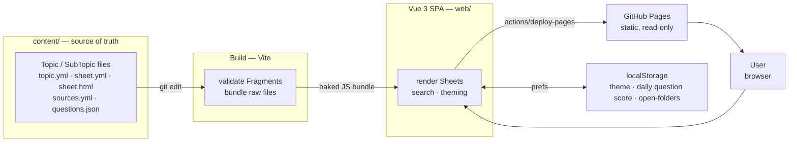
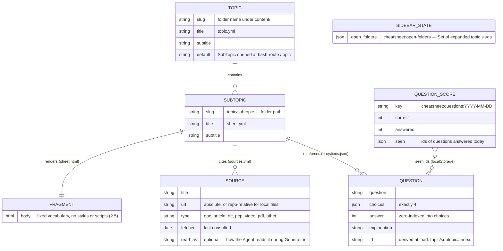
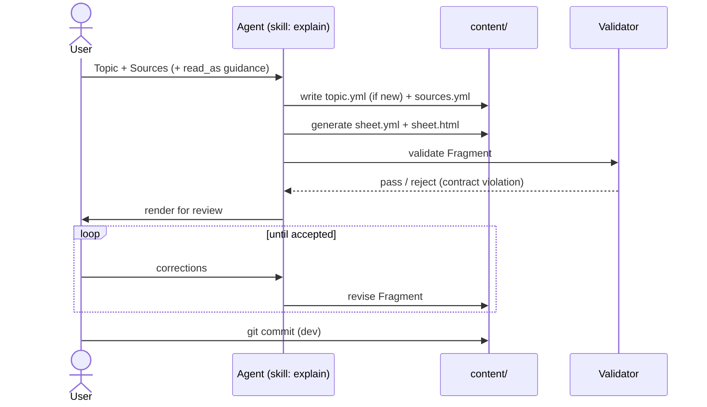
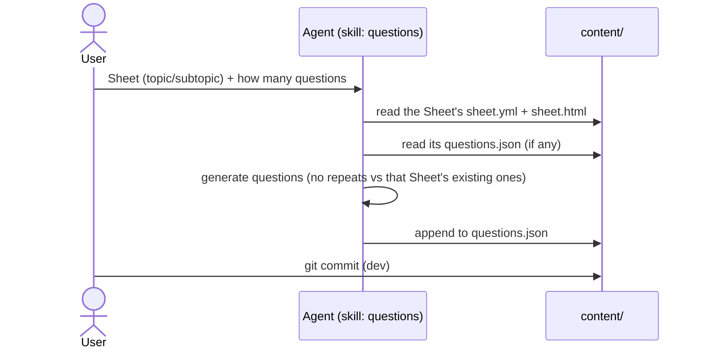
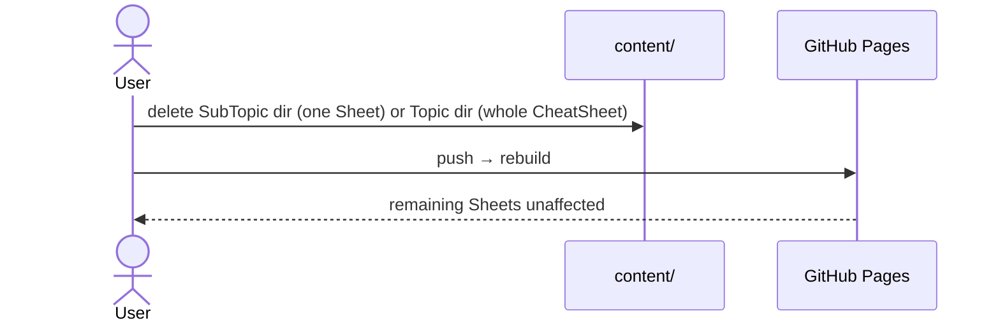
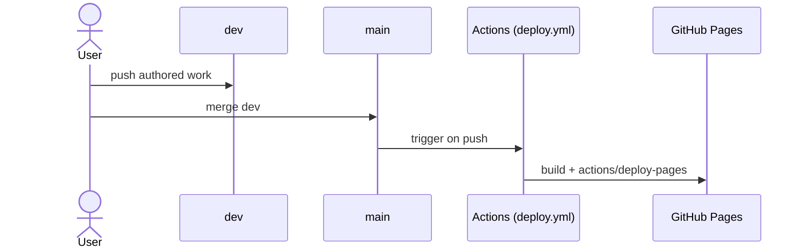

# CheatSheets — High-Level Design Document

> A personal CheatSheet web application that turns studied material into information-dense, spatially-stable single-page reference Sheets optimised for photographic recall, authored as content-as-code and deployed as a static site on GitHub Pages.

The append-only version table lives in [changelog.md](changelog.md). Open Questions and the Improvements Backlog live in [open-issues.md](open-issues.md).

# Table of Contents

- [1. Introduction](#1-introduction)
- [2. Architecture](#2-architecture)
- [3. Data Model](#3-data-model)
- [4. Procedures](#4-procedures)
- [5. Infrastructure](#5-infrastructure)

# 1. Introduction

## 1.1 Context

The User has a photographic memory and studies best from single-page, information-dense reference material with strong, stable spatial structure. Existing documentation and note tools optimise for completeness or linear reading, not for relocating a previously-seen fact by its position on a page. The User needs one place to hold their learning journey — optimised for photographic recall and reachable from any device.

## 1.2 Proposal

Two Goals, both of which must be met:

- **Learning Consolidation** — a comprehensive overview of a studied topic, graspable in one glance, leaning on photographic memory.
- **Learning Retention** — a reference to look up a specific fact, plus active reinforcement through daily recall questions.

**In scope (deliberate commitments):** content-as-code authoring under `content/`; one Sheet format — a semantic HTML Fragment rendered natively in the site's design system; Light/Dark theming that follows the OS until explicitly chosen; in-Sheet search highlighting matches in place; small-screen read-only rendering; per-Sheet Source attribution footer; practice questions drawn at random from the accumulated Question Bank, scored per day.

**Out of scope (deliberate exclusions):** completeness of information — a Sheet covers what the User has studied, not the whole topic; no backend, authentication, or server-side persistence; no runtime content editing — all mutation flows through local file edits and `git push`; no preview or staging environment.

# 2. Architecture

The application has no application layer: `content/` acts as the data layer (single source of truth), the `web/` Vue app is the presentation layer, and there is no server in between. Content files are read at build time, parsed, and baked into the JavaScript bundle; the bundle is deployed as static files and personalises itself per-browser via `localStorage`.

```mermaid
flowchart LR
    subgraph authoring["content/ — source of truth"]
        C["Topic / SubTopic files<br/>topic.yml · sheet.yml · sheet.html<br/>sources.yml · questions.json"]
    end
    subgraph build["Build — Vite"]
        B["validate Fragments<br/>bundle raw files"]
    end
    subgraph app["Vue 3 SPA — web/"]
        A["render Sheets<br/>search · theming"]
    end
    H["GitHub Pages<br/>static, read-only"]
    U["User<br/>browser"]
    LS["localStorage<br/>theme · daily question score · open-folders"]

    C -->|git edit| B
    B -->|baked JS bundle| A
    A -->|actions/deploy-pages| H
    H --> U
    U --> A
    A <-->|prefs| LS
```

## 2.1 Content-as-code

Sheets are authored as HTML Fragments + YAML under `content/` and bundled at build time — no runtime fetching, no CMS, no database. The content format is the stable contract between authoring and rendering: the format leads, the validator and renderer follow. A feature that seems to need a new vocabulary element or manifest field is a format amendment first.

## 2.2 Theming

Light and Dark themes resolve through CSS custom properties toggled by a single class on `<html>` — no per-component dark variants; every colour flips globally. First visit follows the OS preference and tracks live OS changes until the User explicitly toggles; the choice then persists to `localStorage` and overrides the OS signal. A synchronous inline script in `index.html` sets the class before the stylesheet loads, preventing a flash of the wrong theme. When `localStorage` is blocked (e.g. private browsing), preferences degrade gracefully to the current session rather than failing.

## 2.3 Hash routing

Hash routing (`#/topic/subtopic`) is deliberate: GitHub Pages serves static files only, so without it every deep link would 404 unless a `404.html` SPA fallback were wired up. Hash URLs sidestep that with no extra configuration.

## 2.4 Responsive layout

Single breakpoint at **768px** divides two layout models:

- **Desktop (≥768px)** — a persistent 268px Sidebar (content tree) beside the Sheet Quadrant (`flex:1`). Both panes scroll independently. Sources open as a 300px drawer inside the quadrant.
- **Mobile (<768px)** — two full-screen modes, no persistent sidebar. `/` renders the tree as a full-viewport screen; `/:topic/:subtopic` and `/questions` render content full-bleed with a 46px nav bar and a back affordance to `/`. Sources open near-fullscreen (top: 104px). `isSmallScreen` in `store.js` is the single source of truth and matches the CSS media query exactly.

`Sidebar.vue` serves both models through a `variant` prop (`'rail'` for the desktop pane, `'screen'` for the mobile tree). `Home.vue` renders `<Sidebar variant="screen">` below the breakpoint.

## 2.5 Dependency constraint

No runtime dependencies beyond the existing set (Vue, vue-router). The bundle must stay free of Node-oriented libraries — the in-repo YAML parser exists precisely because `js-yaml` and `gray-matter` throw `Buffer is not defined` in the browser. Adding a runtime dependency requires a design amendment, not a silent install.

## 2.6 Fragment contract

A Sheet's body is a **Fragment** (`sheet.html`): semantic HTML written in a fixed vocabulary, carrying structure and content only — no styles, no scripts, no external resources, no colours. The site owns everything else:

- **Styling** — one site-owned stylesheet styles the vocabulary through the theme custom properties, so every Sheet follows the design system and Light/Dark.
- **Behaviour** — the renderer derives the Table of Contents from the Fragment's sections, owns scroll-spy and anchor scrolling, and applies search highlighting to the rendered content.
- **Validation** — a build-time validator rejects any Fragment outside the contract; the validator code is authoritative for the exhaustive allow-list, this section for the contract.

Source links never appear inside a Fragment — attribution lives in `sources.yml` and renders through the app's Sources footer.

# 3. Data Model

There is no database. The data model is the file-system content model under `content/` (authored, bundled at build time) plus a per-browser runtime store in `localStorage`.

```mermaid
erDiagram
    TOPIC ||--o{ SUBTOPIC : contains
    SUBTOPIC ||--|| FRAGMENT : "renders (sheet.html)"
    SUBTOPIC ||--o{ SOURCE : "cites (sources.yml)"
    SUBTOPIC ||--o{ QUESTION : "reinforces (questions.json)"
    QUESTION_SCORE }o--o{ QUESTION : "seen ids (localStorage)"

    TOPIC {
        string slug "folder name under content/"
        string title "topic.yml"
        string subtitle
        string default "SubTopic opened at hash-route /topic"
    }
    SUBTOPIC {
        string slug "topic/subtopic — folder path"
        string title "sheet.yml"
        string subtitle
    }
    FRAGMENT {
        html body "fixed vocabulary, no styles or scripts (2.5)"
    }
    SOURCE {
        string title
        string url "absolute, or repo-relative for local files"
        string type "doc, article, rfc, pep, video, pdf, other"
        date fetched "last consulted"
        string read_as "optional — how the Agent reads it during Generation"
    }
    QUESTION {
        string question
        json choices "exactly 4"
        int answer "zero-indexed into choices"
        string explanation
        string id "derived at load: topic/subtopic#index"
    }
    QUESTION_SCORE {
        string key "cheatsheet:questions:YYYY-MM-DD"
        int correct
        int answered
        json seen "ids of questions answered today"
    }
    SIDEBAR_STATE {
        json open_folders "cheatsheet:open-folders — Set of expanded topic slugs"
    }
```

Semantics the code cannot tell you:

- **Default SubTopic** — with no `default` key, the loader opens the lexicographically last SubTopic, so version-named SubTopics open on the newest.
- **Questions** — each SubTopic may carry a `questions.json`: a plain JSON array of `{question, choices, answer, explanation}` entries. Append-only, and order is part of the record — the app derives each question's stable id as `topic/subtopic#index` from the file path and array position (editing or reordering shifts ids; the daily reset bounds the damage to one day). Semantically deduplicated per SubTopic by the generator (same fact or same angle counts as a repeat). The Bank is the union of every `questions.json`; the web app keeps these files out of the main bundle and fetches them all on the first question draw.
- **Daily score reset** — on load the app removes any `cheatsheet:questions:*` key whose date differs from the local date; score and seen ids restart each day. Draws never repeat a `seen` question; once the whole Bank has been seen in one day, `seen` clears and drawing recycles while the score keeps counting.
- **`read_as`** — one line telling the Agent *how* to read a Source when producing the Sheet: what to extract, what to skip, its role.
- **`cheatsheet:open-folders`** — JSON array of topic slugs whose sidebar folders are expanded. Degrades gracefully when `localStorage` is blocked (session-only fallback).

# 4. Procedures

Development is pushed forward by the User working with the Agent. Each procedure names the Skills the Agent leverages.

## 4.1 P1 — Author or refresh a Sheet

**Skills:** `explain` (Fragment vocabulary and authoring rules).

The iterative **Generation** process: the User picks the topic and assembles Sources; the Agent produces the Sheet; rounds of review continue until the User accepts. When Sources change, update `sources.yml` and re-run.

```mermaid
sequenceDiagram
    actor U as User
    participant A as Agent (skill: explain)
    participant C as content/
    participant V as Validator
    U->>A: Topic + Sources (+ read_as guidance)
    A->>C: write topic.yml (if new) + sources.yml
    A->>C: generate sheet.yml + sheet.html
    A->>V: validate Fragment
    V-->>A: pass / reject (contract violation)
    A->>U: render for review
    loop until accepted
        U->>A: corrections
        A->>C: revise Fragment
    end
    U->>C: git commit (dev)
```

## 4.2 P2 — Grow a Sheet's questions

**Skills:** `questions` (question intent and quality rules).

On demand — typically right after authoring or refreshing a Sheet (P1). The User names the Sheet; the Agent reads only that Sheet and its existing questions, then appends. The app draws from the union of every `questions.json` at random, so there is no "today's set" and no scheduled routine.

```mermaid
sequenceDiagram
    actor U as User
    participant A as Agent (skill: questions)
    participant C as content/
    U->>A: Sheet (topic/subtopic) + how many questions
    A->>C: read the Sheet's sheet.yml + sheet.html
    A->>C: read its questions.json (if any)
    A->>A: generate questions (no repeats vs that Sheet's existing ones)
    A->>C: append to questions.json
    U->>C: git commit (dev)
```

## 4.3 P3 — Remove content

**Skills:** none — a plain file operation.

```mermaid
sequenceDiagram
    actor U as User
    participant C as content/
    participant P as GitHub Pages
    U->>C: delete SubTopic dir (one Sheet) or Topic dir (whole CheatSheet)
    U->>P: push → rebuild
    P-->>U: remaining Sheets unaffected
```

## 4.4 P4 — Deploy

**Skills:** none. `dev` is the integration branch; `main` is the deploy target only.

```mermaid
sequenceDiagram
    actor U as User
    participant D as dev
    participant M as main
    participant GA as Actions (deploy.yml)
    participant P as GitHub Pages
    U->>D: push authored work
    U->>M: merge dev
    M->>GA: trigger on push
    GA->>P: build + actions/deploy-pages
```

# 5. Infrastructure

- **Local** — `npm install` + `npm run dev` inside `web/` (port 5173, hot reload); `npm run build` fails on any Fragment contract violation, and the validator also runs standalone as `npm run validate`. No env vars, no services.
- **Branches** — no hosted dev/staging tier (deliberate: small personal scope). Work integrates on `dev`; promotion to `main` publishes.
- **Production** — push to `main` triggers `.github/workflows/deploy.yml`, which builds and deploys to GitHub Pages via `actions/deploy-pages`. The deployed site is static and read-only.
