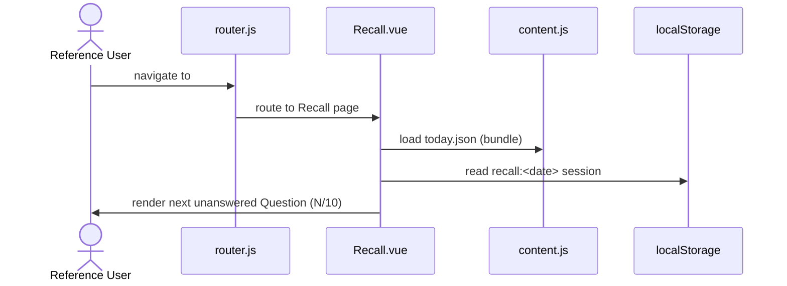
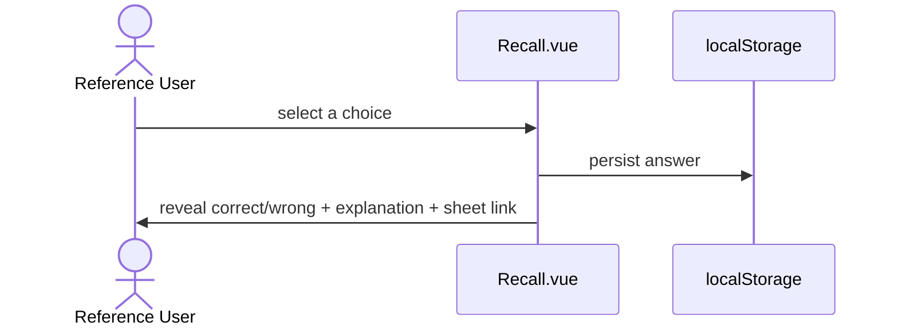
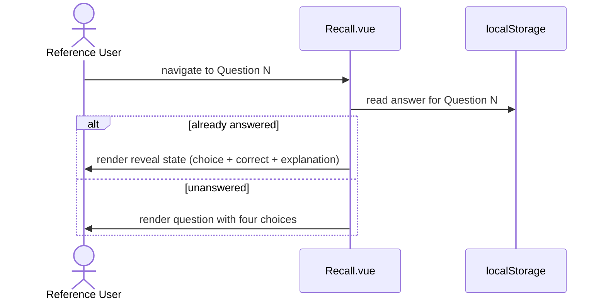
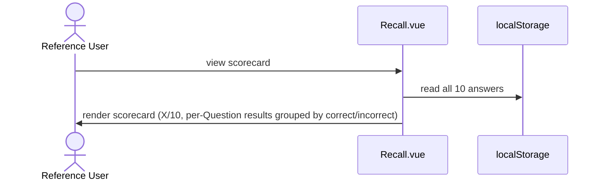
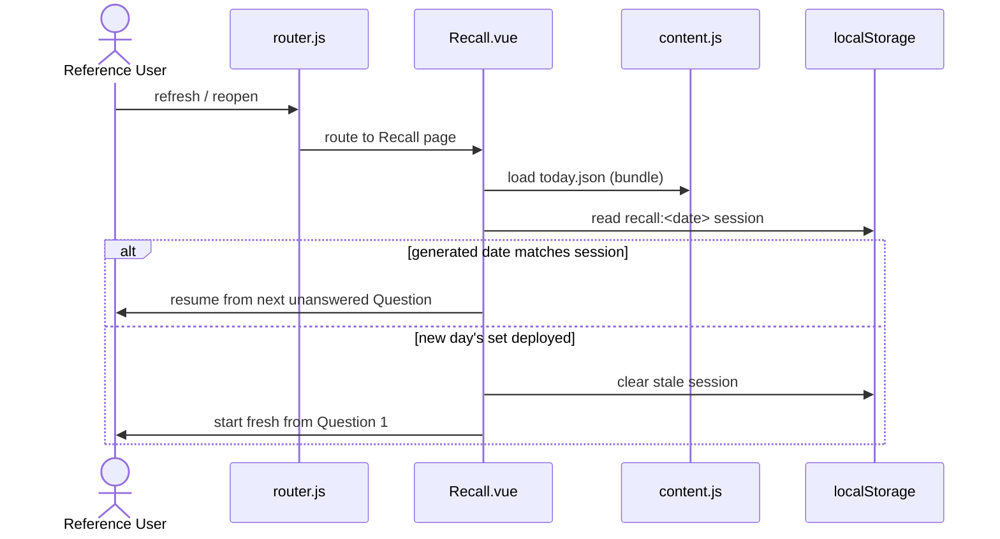
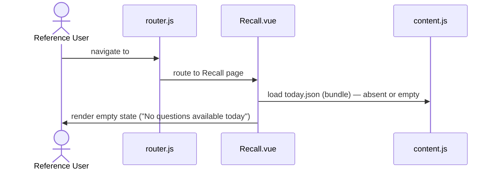

# US-daily-recall — Answer daily questions to reinforce learning

> Context: [Retention](../retention.md)

**As a** `Reference User`, \
**I can** open `Daily Recall` and answer 10 multiple-choice questions drawn from my existing `Sheet`s, seeing immediate feedback after each answer and a scorecard at the end, \
**so that** I reinforce retention of topics I have studied but may not actively work with.

**Background:**

```gherkin
Given a `Daily Recall` set has been generated and deployed
```

## AC-daily-recall.1 — Open `Daily Recall` and see the next unanswered `Question` — Happy Path

```gherkin
Given the `Reference User` navigates to the `Daily Recall` route,
When the page loads,
Then the next unanswered `Question` is displayed with its text, topic/subtopic badge, and four choices,
    And the current position is shown (e.g. 1 of 10)
```

**Feature file:** `frontend/e2e/features/retention/daily-recall.feature` *(not yet generated)*



### Data Model
- `Daily Recall` set (`content/recall/today.json`) — defined in [Master §4.1](../../hldd.md#41-content-entities); loaded by [content.js](../../../../web/src/lib/content.js).
- `Daily Recall` session state (`localStorage` `recall:<date>`) — defined in [Master §4.2](../../hldd.md#42-runtime-settings-store).

### Frontend
- [router.js](../../../../web/src/router.js) — registers `#/recall` route.
- [Recall.vue](../../../../web/src/pages/Recall.vue) — renders question view.
- [App.vue](../../../../web/src/App.vue) — nav bar link to Daily Recall.
- [content.js](../../../../web/src/lib/content.js) — loads and exports `today.json`.

## AC-daily-recall.2 — Answer a `Question` and see feedback — Happy Path

```gherkin
Given the `Reference User` is viewing an unanswered `Question`,
When the `Reference User` selects one of the four choices,
Then the correct choice is highlighted as correct,
    And if the selected choice was wrong it is highlighted as incorrect,
    And an explanation of the correct answer is displayed,
    And a link to the source `Sheet` is displayed
```

**Feature file:** `frontend/e2e/features/retention/daily-recall.feature` *(not yet generated)*



### Data Model
- `Daily Recall` session state (`localStorage` `recall:<date>`) — defined in [Master §4.2](../../hldd.md#42-runtime-settings-store).

### Frontend
- [Recall.vue](../../../../web/src/pages/Recall.vue) — handles answer selection, renders reveal state.

## AC-daily-recall.3 — Navigate between `Question`s — Happy Path

```gherkin
Given the `Reference User` is viewing the `Daily Recall` set,
When the `Reference User` navigates to a different `Question`,
Then that `Question` is displayed,
    And if it was already answered the reveal state is shown,
    And if it was not yet answered the choices are shown unanswered
```

**Feature file:** `frontend/e2e/features/retention/daily-recall.feature` *(not yet generated)*



### Data Model
- `Daily Recall` session state (`localStorage` `recall:<date>`) — defined in [Master §4.2](../../hldd.md#42-runtime-settings-store).

### Frontend
- [Recall.vue](../../../../web/src/pages/Recall.vue) — handles navigation between questions, renders appropriate state per question.

## AC-daily-recall.4 — Complete all `Question`s and see the scorecard — Happy Path

```gherkin
Given the `Reference User` has answered all 10 `Question`s in the `Daily Recall` set,
When the `Reference User` views the scorecard,
Then the total score is displayed as correct out of 10,
    And each `Question` is listed with the `Reference User`'s choice and the correct answer,
    And `Question`s are grouped by correct and incorrect
```

**Feature file:** `frontend/e2e/features/retention/daily-recall.feature` *(not yet generated)*



### Data Model
- `Daily Recall` session state (`localStorage` `recall:<date>`) — defined in [Master §4.2](../../hldd.md#42-runtime-settings-store).

### Frontend
- [Recall.vue](../../../../web/src/pages/Recall.vue) — renders the summary/scorecard state.

## AC-daily-recall.5 — Resume after page refresh — Happy Path

```gherkin
Given the `Reference User` has answered some `Question`s in the current `Daily Recall` set,
When the `Reference User` refreshes or reopens the page,
Then the `Daily Recall` resumes from the next unanswered `Question`,
    And previously given answers are preserved
```

**Feature file:** `frontend/e2e/features/retention/daily-recall.feature` *(not yet generated)*



### Data Model
- `Daily Recall` set (`content/recall/today.json`) — `generated` field compared against localStorage key; defined in [Master §4.1](../../hldd.md#41-content-entities).
- `Daily Recall` session state (`localStorage` `recall:<date>`) — defined in [Master §4.2](../../hldd.md#42-runtime-settings-store).

### Frontend
- [Recall.vue](../../../../web/src/pages/Recall.vue) — compares `generated` date vs localStorage key, resumes or resets.

## AC-daily-recall.6 — No questions available — Sad Path

```gherkin
Given no `Daily Recall` set has been generated or deployed,
When the `Reference User` navigates to the `Daily Recall` route,
Then an empty state is displayed indicating no questions are available today
```

**Feature file:** `frontend/e2e/features/retention/daily-recall.feature` *(not yet generated)*



### Data Model
- `Daily Recall` set (`content/recall/today.json`) — absent or empty at build time; defined in [Master §4.1](../../hldd.md#41-content-entities).

### Frontend
- [Recall.vue](../../../../web/src/pages/Recall.vue) — renders empty state when no questions are loaded.

## NFR Checklist

- [ ] **Usability:** The `Daily Recall` page is usable on viewports down to 375px width — single-column layout, touch-sized choice targets (minimum 44×44px).
- [ ] **Performance:** The `Daily Recall` route renders within the same budget as any `Sheet` route — no additional network requests beyond the bundled content.
