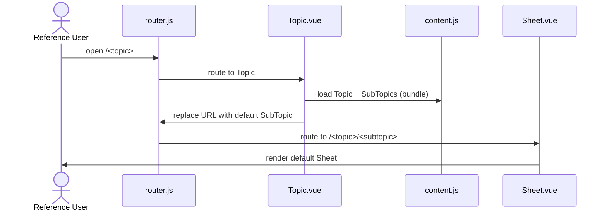
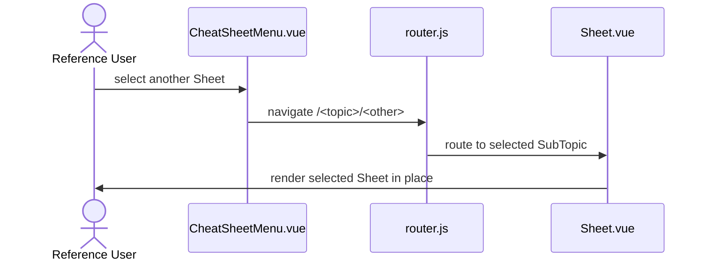
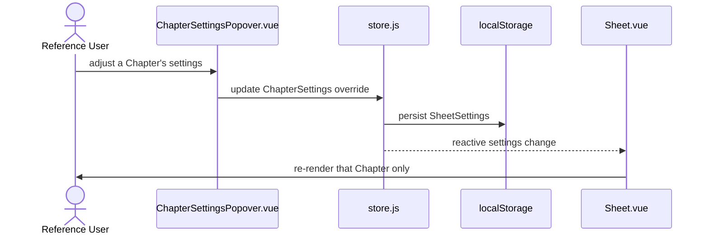
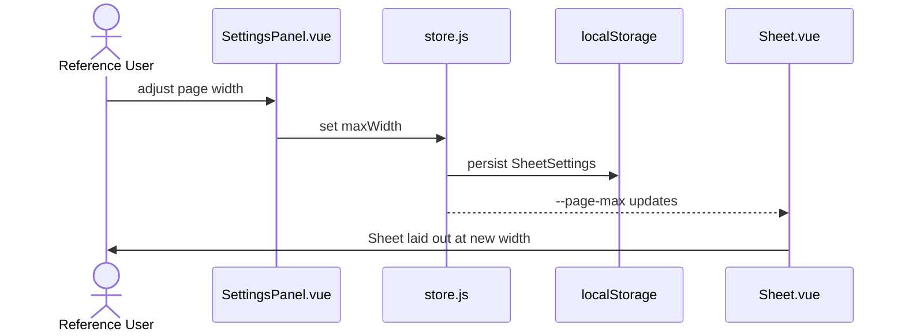
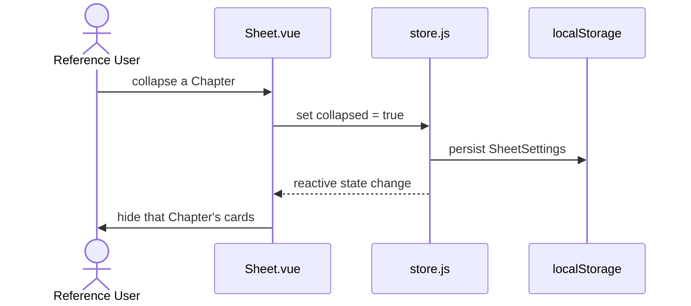

# US-4 — Browse a CheatSheet and read its Sheets

> Context: [View](../view.md)

**As a** `Reference User`, \
**I can** open a `CheatSheet` and navigate between its `Sheet`s, \
**so that** I can recall what I have studied using my photographic memory.

**Background**

```gherkin
Given a `CheatSheet` exists with multiple `Sheet`s
```

> The **APIs**, **Backend**, and **Microservices** pointer sections are not applicable to any AC in this Story — the app is a static site with no backend ([Master §5](../../hldd.md#5-api)). Each AC gives only its Data Model and Frontend pointers.

## AC-4.1 — Open a `CheatSheet` — Happy Path

```gherkin
Given the `Reference User` has a `CheatSheet` available in their list,
When the `Reference User` opens the `CheatSheet`,
Then the `CheatSheet` is displayed,
    And one of its `Sheet`s is shown by default
```

**Feature file:** `frontend/e2e/features/view/browse-cheatsheet.feature` *(not yet generated)*



### Data Model
- `Topic` / `SubTopic` — content bundle, defined in [Master §4.1](../../hldd.md#41-content-entities); loaded by [content.js](../../../../web/src/lib/content.js).

### Frontend
- [router.js](../../../../web/src/router.js) — resolves `/<topic>` to the default SubTopic.
- [Topic.vue](../../../../web/src/pages/Topic.vue) — loads the CheatSheet and redirects to its default Sheet.
- [Sheet.vue](../../../../web/src/pages/Sheet.vue) — renders the Sheet.

## AC-4.2 — Switch to another `Sheet` within the `CheatSheet` — Happy Path

```gherkin
Given the `Reference User` is viewing a `CheatSheet` with a `Sheet` displayed,
When the `Reference User` selects a different `Sheet`,
Then the selected `Sheet` is displayed in place of the previous one
```

**Feature file:** `frontend/e2e/features/view/browse-cheatsheet.feature` *(not yet generated)*



### Data Model
- `SubTopic` — content bundle, defined in [Master §4.1](../../hldd.md#41-content-entities).

### Frontend
- [CheatSheetMenu.vue](../../../../web/src/components/CheatSheetMenu.vue) — the Sheet picker.
- [router.js](../../../../web/src/router.js) — navigation between SubTopics.
- [Sheet.vue](../../../../web/src/pages/Sheet.vue) — renders the newly selected Sheet.

## AC-4.3 — Personalise the rendering of a `Chapter` — Happy Path

```gherkin
Given the `Reference User` is viewing a `Sheet` with multiple `Chapter`s,
When the `Reference User` adjusts any of the `Chapter`'s rendering settings (`bodySize`, `cardTitleSize`, `chapterTitleSize`, `cols`, `type`),
Then that `Chapter` reflects the new settings,
    And the other `Chapter`s of the `Sheet` remain unchanged,
    And the settings persist across reloads and navigation
```

**Feature file:** `frontend/e2e/features/view/browse-cheatsheet.feature` *(not yet generated)*



### Data Model
- `SheetSettings` / `ChapterSettings` — runtime settings store, defined in [Master §4.2](../../hldd.md#42-runtime-settings-store); owned by [store.js](../../../../web/src/store.js).

### Frontend
- [ChapterSettingsPopover.vue](../../../../web/src/components/ChapterSettingsPopover.vue) — edits a single Chapter's overrides.
- [Sheet.vue](../../../../web/src/pages/Sheet.vue) — applies per-Chapter custom properties.

## AC-4.4 — Adjust the page layout width of a `Sheet` — Happy Path

```gherkin
Given the `Reference User` is viewing a `Sheet`,
When the `Reference User` adjusts the page layout width,
Then the `Sheet` is laid out at the new width,
    And the new width persists across reloads of the same `Sheet`
```

**Feature file:** `frontend/e2e/features/view/browse-cheatsheet.feature` *(not yet generated)*



### Data Model
- `SheetSettings.maxWidth` — runtime settings store, [Master §4.2](../../hldd.md#42-runtime-settings-store).

### Frontend
- [SettingsPanel.vue](../../../../web/src/components/SettingsPanel.vue) — the page-width control.
- [Sheet.vue](../../../../web/src/pages/Sheet.vue) — consumes `--page-max`.

## AC-4.5 — Collapse and expand `Chapter`s — Happy Path

```gherkin
Given the `Reference User` is viewing a `Sheet` with multiple `Chapter`s,
When the `Reference User` collapses a `Chapter`,
Then that `Chapter`'s cards are hidden,
    And the collapsed state persists across reloads and navigation,
    And the state of every other `Chapter` is preserved
```

**Feature file:** `frontend/e2e/features/view/browse-cheatsheet.feature` *(not yet generated)*



### Data Model
- `ChapterSettings.collapsed` — runtime settings store, [Master §4.2](../../hldd.md#42-runtime-settings-store).

### Frontend
- [Sheet.vue](../../../../web/src/pages/Sheet.vue) — the Chapter rail and collapse control.

## AC-4.6 — Card detail renders as a sub-row beneath card cells — Happy Path

```gherkin
Given the `Reference User` is viewing a `Sheet` whose cards include rows with a non-empty detail value,
When the `Sheet` is rendered,
Then each such row's detail content renders as a muted sub-row beneath the row's cells,
    And rows whose detail value is empty or absent render as a single line with no sub-row
```

**Feature file:** `frontend/e2e/features/view/browse-cheatsheet.feature` *(not yet generated)*

```mermaid
sequenceDiagram
    actor U as Reference User
    participant PC as parseCheatsheet.js
    participant S as Sheet.vue
    participant CD as Card.vue
    U->>S: view Sheet
    S->>PC: parse cards (detail column)
    S->>CD: render rows
    CD->>U: detail present → muted sub-row; empty → single line
```

### Data Model
- Card row `detail` field — card format, [Master §4.1](../../hldd.md#41-content-entities); parsed by [parseCheatsheet.js](../../../../web/src/lib/parseCheatsheet.js).

### Frontend
- [Card.vue](../../../../web/src/components/Card.vue) — renders the detail sub-row.
