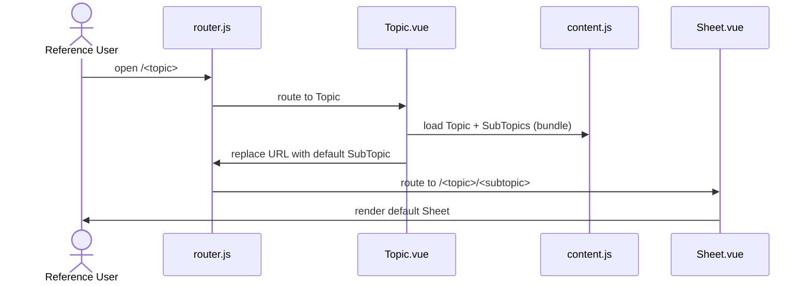
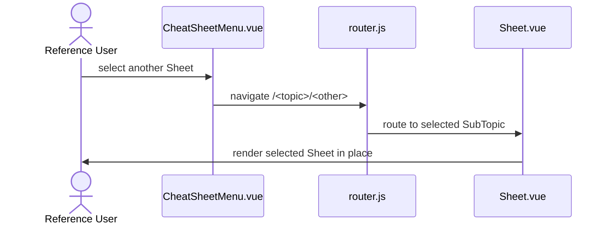

# US-4 — Browse a CheatSheet and read its Sheets

> Context: [View](../view.md)

**As a** `Reference User`, \
**I can** open a `CheatSheet` and navigate between its `Sheet`s, \
**so that** I can recall what I have studied using my photographic memory.

**Background**

```gherkin
Given a `CheatSheet` exists with multiple `Sheet`s
```

> The **APIs**, **Backend**, and **Microservices** pointer sections are not applicable to any AC in this Story — the app is a static site with no backend ([Master §5](../../hldd.md#5-api)). Each AC gives only its Data Model and Frontend pointers.

## AC-4.1 — Open a `CheatSheet` — Happy Path

```gherkin
Given the `Reference User` has a `CheatSheet` available in their list,
When the `Reference User` opens the `CheatSheet`,
Then the `CheatSheet` is displayed,
    And one of its `Sheet`s is shown by default
```


```mermaid
sequenceDiagram
    actor U as Reference User
    participant R as router.js
    participant T as Topic.vue
    participant C as content.js
    participant S as Sheet.vue
    U->>R: open /<topic>
    R->>T: route to Topic
    T->>C: load Topic + SubTopics (bundle)
    T->>R: replace URL with default SubTopic
    R->>S: route to /<topic>/<subtopic>
    S->>U: render default Sheet
```

### Data Model
- `Topic` / `SubTopic` — content bundle, defined in [Master §4.1](../../hldd.md#41-content-entities); loaded by [content.js](../../../../web/src/lib/content.js).

### Frontend
- [router.js](../../../../web/src/router.js) — resolves `/<topic>` to the default SubTopic.
- [Topic.vue](../../../../web/src/pages/Topic.vue) — loads the CheatSheet and redirects to its default Sheet.
- [Sheet.vue](../../../../web/src/pages/Sheet.vue) — renders the Sheet.

## AC-4.2 — Switch to another `Sheet` within the `CheatSheet` — Happy Path

```gherkin
Given the `Reference User` is viewing a `CheatSheet` with a `Sheet` displayed,
When the `Reference User` selects a different `Sheet`,
Then the selected `Sheet` is displayed in place of the previous one
```


```mermaid
sequenceDiagram
    actor U as Reference User
    participant M as CheatSheetMenu.vue
    participant R as router.js
    participant S as Sheet.vue
    U->>M: select another Sheet
    M->>R: navigate /<topic>/<other>
    R->>S: route to selected SubTopic
    S->>U: render selected Sheet in place
```

### Data Model
- `SubTopic` — content bundle, defined in [Master §4.1](../../hldd.md#41-content-entities).

### Frontend
- [CheatSheetMenu.vue](../../../../web/src/components/CheatSheetMenu.vue) — the Sheet picker.
- [router.js](../../../../web/src/router.js) — navigation between SubTopics.
- [Sheet.vue](../../../../web/src/pages/Sheet.vue) — renders the newly selected Sheet.


