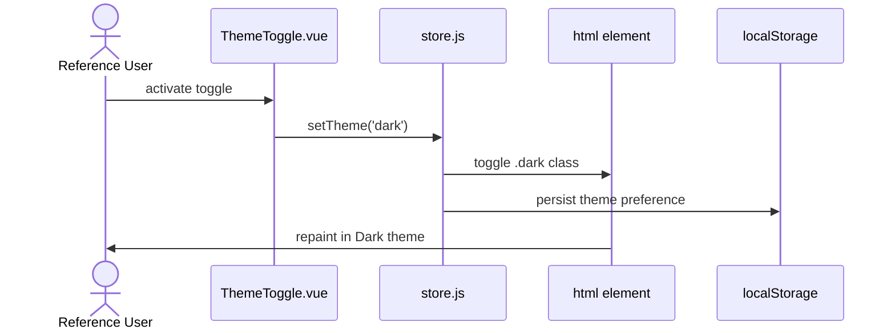
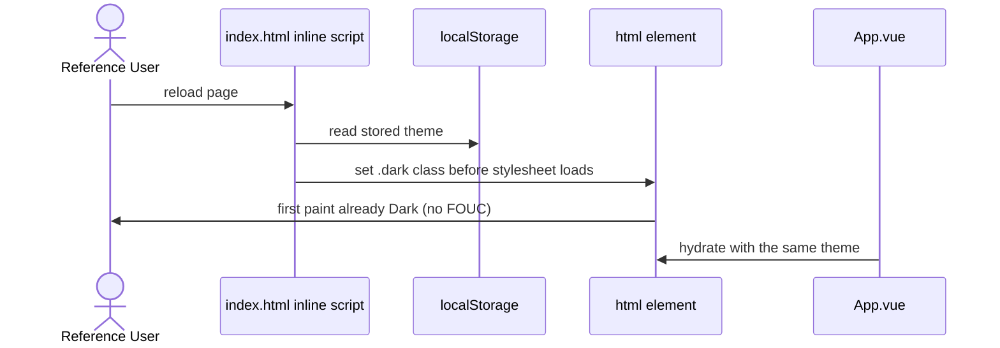
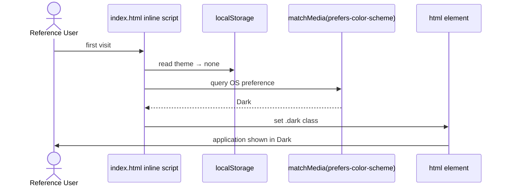
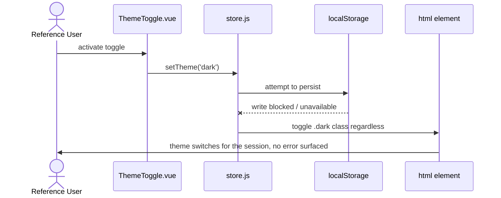

# US-dark-mode — Toggle between Light and Dark display modes

> Context: [View](../view.md)

**As a** `Reference User`, \
**I can** switch the display of my `CheatSheet`s between a Light and a Dark theme, \
**so that** I can read my `Sheet`s comfortably regardless of ambient light or time of day.

> The **APIs**, **Backend**, and **Microservices** pointer sections are not applicable to any AC in this Story — the app is a static site with no backend ([Master §5](../../hldd.md#5-api)). Each AC gives only its Data Model and Frontend pointers.

## AC-dark-mode.1 — Toggle the theme — Happy Path

```gherkin
Given the `Reference User` is viewing a `Sheet` displayed in the Light theme,
When the `Reference User` activates the theme toggle,
Then the `Sheet` is displayed in the Dark theme,
    And every other `Sheet` in every `CheatSheet` is also displayed in the Dark theme on subsequent navigation
```

**Feature file:** `frontend/e2e/features/view/dark-mode.feature` *(not yet generated)*



### Data Model
- Theme preference — persisted under its own `localStorage` key, separate from `SheetSettings` ([Master §4.2](../../hldd.md#42-runtime-settings-store)); owned by [store.js](../../../../web/src/store.js).

### Frontend
- [ThemeToggle.vue](../../../../web/src/components/ThemeToggle.vue) — the toggle control.
- [store.js](../../../../web/src/store.js) — flips the `.dark` class on `<html>` and persists the choice.

## AC-dark-mode.2 — Theme preference persists across reloads — Happy Path

```gherkin
Given the `Reference User` has activated the Dark theme,
When the `Reference User` reloads the page,
Then the application reopens in the Dark theme without a visible flash to the Light theme
```

**Feature file:** `frontend/e2e/features/view/dark-mode.feature` *(not yet generated)*



### Data Model
- Theme preference key — `localStorage` ([Master §4.2](../../hldd.md#42-runtime-settings-store)).

### Frontend
- [index.html](../../../../web/index.html) — synchronous inline script that sets the theme class before the stylesheet loads.
- [store.js](../../../../web/src/store.js) — source of the persisted preference.
- [App.vue](../../../../web/src/App.vue) — hydrates with the same theme on mount.

## AC-dark-mode.3 — First visit follows the operating system preference — Happy Path

```gherkin
Given the `Reference User` is opening the application for the first time with no stored theme preference,
    And the operating system reports a Dark theme preference,
When the application loads,
Then the `Reference User` sees the application displayed in the Dark theme
```

**Feature file:** `frontend/e2e/features/view/dark-mode.feature` *(not yet generated)*



### Data Model
- Theme preference key — absent on first visit; OS signal used as the default ([Master §4.2](../../hldd.md#42-runtime-settings-store)).

### Frontend
- [index.html](../../../../web/index.html) — reads the OS preference via `matchMedia` when no stored preference exists.
- [store.js](../../../../web/src/store.js) — tracks live OS changes until the User explicitly toggles.

## AC-dark-mode.4 — Toggle still works when persistent storage is unavailable — Sad Path

```gherkin
Given the `Reference User` is viewing the application in a browsing mode where persistent storage is blocked or unavailable,
When the `Reference User` activates the theme toggle,
Then the visible appearance of the `Sheet` switches between Light and Dark for the current session,
    And the application does not raise a user-visible error
```

**Feature file:** `frontend/e2e/features/view/dark-mode.feature` *(not yet generated)*



### Data Model
- Theme preference — persistence attempt fails silently; in-memory state still drives the class ([Master §4.2](../../hldd.md#42-runtime-settings-store)).

### Frontend
- [ThemeToggle.vue](../../../../web/src/components/ThemeToggle.vue) — the toggle control.
- [store.js](../../../../web/src/store.js) — guards the `localStorage` write so a failure does not break the toggle.

## NFR Checklist

- [ ] **Functionality:** every section type of a `Sheet` (cards, code rows, callouts, the sources footer, the chapter rails) renders legibly in both themes — no hardcoded colour leaks Light values into the Dark theme or vice versa. An `Embedded Sheet` is exempt: it carries its own complete styling and renders as-is regardless of theme (see [AC-embed-view.3](us-embed-view.md)).
- [ ] **Usability (Accessibility):** the theme toggle exposes its current state via `aria-pressed` and is operable by keyboard alone (Tab to focus, Space or Enter to activate); focus is visible against both backgrounds.
- [ ] **Performance:** theme transition completes within 300 ms of activation, including paint, with no layout shift.
- [ ] **Reliability (FOUC prevention):** when the stored or OS-derived theme is Dark, the application's first paint after a reload is already in the Dark theme — at no point does a Light surface flash before the script executes.
