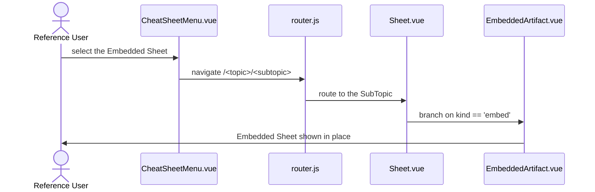
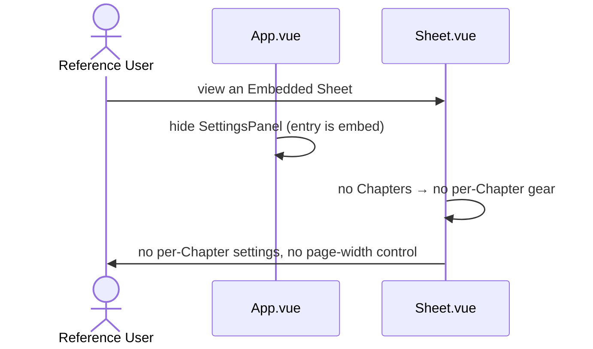

# US-embed-view — View an Embedded Sheet

> Context: [View](../view.md)

**As a** `Reference User`, \
**I can** open an `Embedded Sheet` and see its artifact rendered exactly as built — navigating to and from it like any other `Sheet`, \
**so that** I can consume artifacts inside my `CheatSheet` without losing the unified navigation.

> The **APIs**, **Backend**, and **Microservices** pointer sections are not applicable to any AC in this Story — the app is a static site with no backend ([Master §5](../../hldd.md#5-api)). Each AC gives only its Data Model and Frontend pointers. The isolation mechanism behind these ACs is recorded in [Master §3.6](../../hldd.md#36-embedded-sheet-isolation).

## AC-embed-view.1 — Render the artifact as-is — Happy Path

```gherkin
Given the `Reference User` is viewing an `Embedded Sheet`,
When the artifact is rendered,
Then the artifact's own styling is preserved,
    And the artifact's CSS does not leak into the rest of the application,
    And the application's styles do not alter the artifact
```

**Feature file:** `frontend/e2e/features/view/embed-view.feature` *(not yet generated)*

```mermaid
sequenceDiagram
    actor U as Reference User
    participant S as Sheet.vue
    participant EA as EmbeddedArtifact.vue
    participant IF as iframe srcdoc
    U->>S: open an Embedded Sheet
    S->>EA: kind == 'embed' → render artifact
    EA->>IF: mount artifact.html in a same-origin srcdoc
    IF->>U: artifact shown as-is; styles isolated both ways
```

### Data Model
- Artifact SubTopic `artifact.html` — content bundle, [Master §4.1](../../hldd.md#41-content-entities); loaded as `artifactHtml` by [content.js](../../../../web/src/lib/content.js).

### Frontend
- [Sheet.vue](../../../../web/src/pages/Sheet.vue) — branches to the embedded renderer on `kind: embed`.
- [EmbeddedArtifact.vue](../../../../web/src/components/EmbeddedArtifact.vue) — mounts the artifact in a same-origin `<iframe srcdoc>` with auto-height.

## AC-embed-view.2 — Navigate to an `Embedded Sheet` like any other — Happy Path

```gherkin
Given the `Reference User` is viewing a `CheatSheet` that contains both card-authored `Sheet`s and an `Embedded Sheet`,
When the `Reference User` selects the `Embedded Sheet` from the Sheet picker,
Then the `Embedded Sheet` is displayed in place of the previous `Sheet`,
    And it is selectable in the same way as any card-authored `Sheet`
```

**Feature file:** `frontend/e2e/features/view/embed-view.feature` *(not yet generated)*



### Data Model
- `SubTopic` with `kind: embed` — content bundle, [Master §4.1](../../hldd.md#41-content-entities).

### Frontend
- [CheatSheetMenu.vue](../../../../web/src/components/CheatSheetMenu.vue) — the Sheet picker, identical for both kinds.
- [router.js](../../../../web/src/router.js) — navigation.
- [Sheet.vue](../../../../web/src/pages/Sheet.vue) — shares header and Sources footer with card-authored Sheets.

## AC-embed-view.3 — Theme toggle leaves the artifact unchanged — Happy Path

```gherkin
Given the `Reference User` is viewing an `Embedded Sheet`,
When the `Reference User` toggles between the Light and Dark themes,
Then the application chrome reflects the selected theme,
    And the artifact's internal rendering remains unchanged
```

**Feature file:** `frontend/e2e/features/view/embed-view.feature` *(not yet generated)*

```mermaid
sequenceDiagram
    actor U as Reference User
    participant TT as ThemeToggle.vue
    participant ST as store.js
    participant H as html element
    participant IF as iframe srcdoc
    U->>TT: toggle theme
    TT->>ST: setTheme
    ST->>H: flip .dark class on app chrome
    Note over IF: iframe is isolated — artifact rendering unaffected
    H->>U: chrome reflects theme; artifact identical
```

### Data Model
- Theme preference key — `localStorage` ([Master §4.2](../../hldd.md#42-runtime-settings-store)).

### Frontend
- [ThemeToggle.vue](../../../../web/src/components/ThemeToggle.vue) / [store.js](../../../../web/src/store.js) — theme applies to chrome only.
- [EmbeddedArtifact.vue](../../../../web/src/components/EmbeddedArtifact.vue) — the isolated iframe the theme cannot reach.

## AC-embed-view.4 — Search highlights matches inside the artifact — Happy Path

```gherkin
Given the `Reference User` is viewing an `Embedded Sheet` whose artifact contains the term "model",
When the `Reference User` types "model" into the search input,
Then every occurrence of "model" inside the artifact is highlighted in place,
    And no card-blanking occurs because an `Embedded Sheet` has no cards
```

> Search here extends `US-sheet-search` to `Embedded Sheet`s; the non-matching-card blanking in [AC-sheet-search.1](us-sheet-search.md) has no effect since an `Embedded Sheet` has no cards.

**Feature file:** `frontend/e2e/features/view/embed-view.feature` *(not yet generated)*

```mermaid
sequenceDiagram
    actor U as Reference User
    participant SB as SearchBar.vue
    participant ST as store.js
    participant EA as EmbeddedArtifact.vue
    participant TW as TreeWalker (frame document)
    U->>SB: type "model"
    SB->>ST: set searchQuery
    ST-->>EA: watch(searchQuery)
    EA->>TW: wrap matches in mark.search-hit elements
    TW->>U: occurrences highlighted inside the artifact; no card-blanking
```

### Data Model
- `searchQuery` — transient runtime state (not persisted), held in [store.js](../../../../web/src/store.js).

### Frontend
- [SearchBar.vue](../../../../web/src/components/SearchBar.vue) — the shared search input.
- [EmbeddedArtifact.vue](../../../../web/src/components/EmbeddedArtifact.vue) — a `TreeWalker` over the frame document wraps matches; no card-blanking.

## AC-embed-view.5 — Per-Chapter and page-width controls are absent — Happy Path

```gherkin
Given the `Reference User` is viewing an `Embedded Sheet`,
When the `Sheet` is rendered,
Then the per-`Chapter` settings gears are not shown,
    And the page-width control is not shown
```

**Feature file:** `frontend/e2e/features/view/embed-view.feature` *(not yet generated)*



### Data Model
- `SheetSettings` — unused for an `Embedded Sheet` ([Master §4.2](../../hldd.md#42-runtime-settings-store)).

### Frontend
- [App.vue](../../../../web/src/App.vue) — hides the page-width `SettingsPanel` when the entry is embedded.
- [Sheet.vue](../../../../web/src/pages/Sheet.vue) — renders no Chapter rail (an Embedded Sheet has no Chapters).
