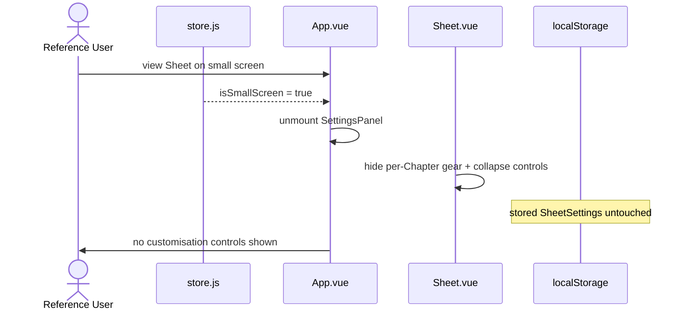
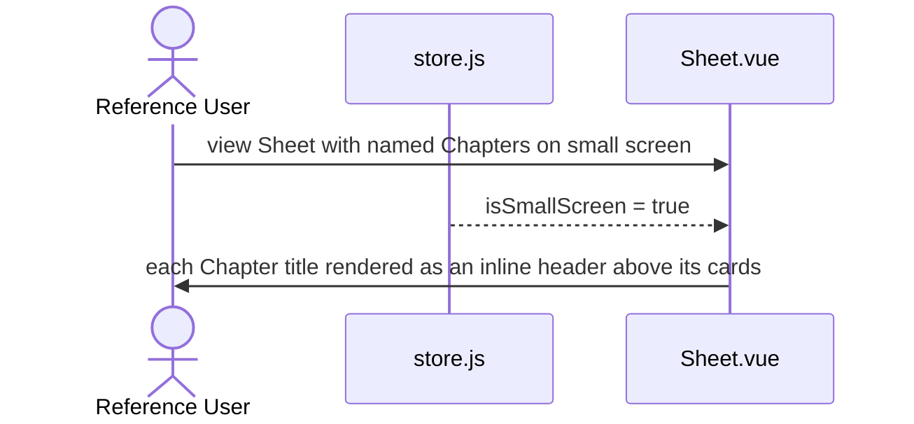
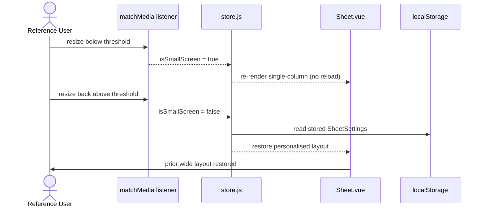

# US-mobile-readonly — Read a Sheet on a small screen

> Context: [View](../view.md)

**As a** `Reference User`, \
**I can** open a `Sheet` on a small-screen device and read it as a single-column, vertically-scrolled view with customisation controls hidden, \
**so that** I can quickly look up information from a `Sheet` while away from my desk without fighting a layout that assumes a wide viewport.

> The **APIs**, **Backend**, and **Microservices** pointer sections are not applicable to any AC in this Story — the app is a static site with no backend ([Master §5](../../hldd.md#5-api)). Each AC gives only its Data Model and Frontend pointers.

## AC-mobile-readonly.1 — Render every `Chapter` as a single column on a small screen — Happy Path

```gherkin
Given the `Reference User` is viewing a `Sheet` whose `Chapter`s use a multi-column layout,
    And the viewport width is below the small-screen threshold,
When the `Sheet` is rendered,
Then every `Chapter` displays its cards stacked one per row at full available width,
    And personalised layout and page-width constraints are not applied
```

**Feature file:** `frontend/e2e/features/view/mobile-readonly.feature` *(not yet generated)*

```mermaid
sequenceDiagram
    actor U as Reference User
    participant MM as matchMedia(max-width 767.98px)
    participant ST as store.js
    participant App as App.vue
    participant S as Sheet.vue
    U->>App: open Sheet on a narrow viewport
    MM-->>ST: isSmallScreen = true
    ST-->>App: .is-small-screen on root
    ST-->>S: force cards-vertical; skip per-Chapter styles
    S->>U: every Chapter stacked single-column, full width
```

### Data Model
- `SheetSettings` — preserved but not applied while small-screen ([Master §4.2](../../hldd.md#42-runtime-settings-store)).
- `isSmallScreen` — transient runtime flag in [store.js](../../../../web/src/store.js).

### Frontend
- [store.js](../../../../web/src/store.js) — the `isSmallScreen` media-query ref.
- [Sheet.vue](../../../../web/src/pages/Sheet.vue) — forces every Chapter to vertical and skips per-Chapter style injection.

## AC-mobile-readonly.2 — Suppress customisation controls on a small screen — Happy Path

```gherkin
Given the `Reference User` is viewing a `Sheet` on a small screen,
When the `Sheet` is rendered,
Then customisation controls are not available,
    And the `Reference User`'s previously stored personalisation values remain in storage and are reapplied on the next wide-screen viewing
```

**Feature file:** `frontend/e2e/features/view/mobile-readonly.feature` *(not yet generated)*



### Data Model
- `SheetSettings` — remains in `localStorage`, reapplied on the next wide-screen viewing ([Master §4.2](../../hldd.md#42-runtime-settings-store)).

### Frontend
- [App.vue](../../../../web/src/App.vue) — unmounts the page-width `SettingsPanel` while small-screen.
- [Sheet.vue](../../../../web/src/pages/Sheet.vue) — replaces the per-Chapter rail/gear/collapse control with a static header.

## AC-mobile-readonly.3 — Render `Chapter` titles as inline headers on a small screen — Happy Path

```gherkin
Given the `Reference User` is viewing a `Sheet` with one or more named `Chapter`s on a small screen,
When the `Sheet` is rendered,
Then each `Chapter`'s title is shown as an inline header above its cards,
    And `Chapter`s are visually separated from one another
```

**Feature file:** `frontend/e2e/features/view/mobile-readonly.feature` *(not yet generated)*



### Data Model
- `Chapter` title — content bundle, [Master §4.1](../../hldd.md#41-content-entities).

### Frontend
- [Sheet.vue](../../../../web/src/pages/Sheet.vue) — renders the mobile inline Chapter header in place of the rail.

## AC-mobile-readonly.4 — Resizing across the threshold switches modes live — Happy Path

```gherkin
Given the `Reference User` is viewing a `Sheet` above the small-screen threshold with a multi-column layout visible,
When the viewport is resized below the small-screen threshold,
Then the `Sheet` re-renders into the small-screen single-column form without a page reload,
    And resizing the viewport back above the threshold restores the prior layout, including the `Reference User`'s stored personalisation
```

**Feature file:** `frontend/e2e/features/view/mobile-readonly.feature` *(not yet generated)*



### Data Model
- `SheetSettings` — reread from `localStorage` when the viewport returns above the threshold ([Master §4.2](../../hldd.md#42-runtime-settings-store)).

### Frontend
- [store.js](../../../../web/src/store.js) — the `matchMedia` listener that drives the live switch.
- [App.vue](../../../../web/src/App.vue) / [Sheet.vue](../../../../web/src/pages/Sheet.vue) — re-render on the reactive flag change without a reload.

## NFR Checklist

- [x] **Functionality:** every section type of a `Sheet` (cards, code rows, callouts, the sources footer, the chapter divider) renders without forcing horizontal page scroll on a 360 px-wide viewport; long unbreakable tokens (URLs, identifiers) are allowed to scroll within their own card body.
- [x] **Usability:** primary controls that remain visible on a small screen (the search input, the theme toggle) keep a minimum tap target of approximately 32 px square and remain operable without hover-only affordances.
- [x] **Performance:** the layout switch triggered by crossing the small-screen threshold (orientation change or window resize) completes on the next paint without a perceptible reload, and the small-screen render does not regress first-contentful-paint relative to the wide-screen render.
