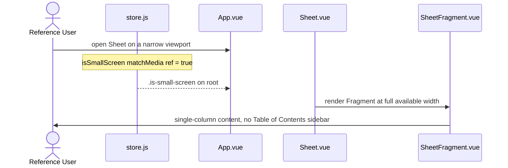
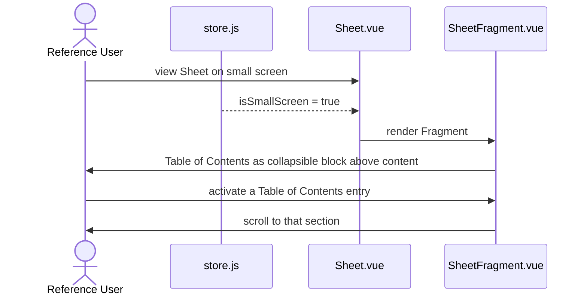
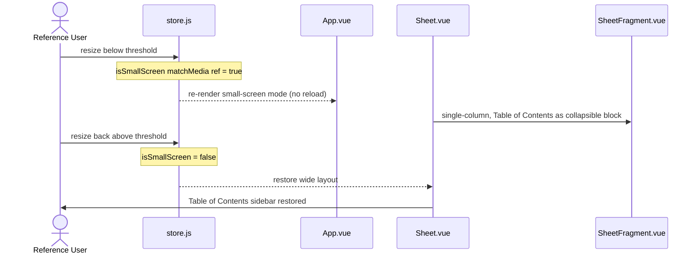

# US-mobile-readonly — Read a Sheet on a small screen

> Context: [View](../view.md)

**As a** `Reference User`, \
**I can** open a `Sheet` on a small-screen device and read it as a single-column, vertically-scrolled view, \
**so that** I can quickly look up information from a `Sheet` while away from my desk without fighting a layout that assumes a wide viewport.

> The **APIs**, **Backend**, and **Microservices** pointer sections are not applicable to any AC in this Story — the app is a static site with no backend ([Master §5](../../hldd.md#5-api)). Each AC gives only its Data Model and Frontend pointers.

## AC-mobile-readonly.1 — Render the `Sheet` as a single column on a small screen — Happy Path

```gherkin
Given the `Reference User` is viewing a `Sheet`,
    And the viewport width is below the small-screen threshold,
When the `Sheet` is rendered,
Then the `Fragment` content displays as a single column at full available width,
    And the `Table of Contents` is not shown as a sidebar,
    And no horizontal page scrolling is required
```


```mermaid
sequenceDiagram
    actor U as Reference User
    participant ST as store.js
    participant App as App.vue
    participant S as Sheet.vue
    participant F as SheetFragment.vue
    U->>App: open Sheet on a narrow viewport
    Note over ST: isSmallScreen matchMedia ref = true
    ST-->>App: .is-small-screen on root
    S->>F: render Fragment at full available width
    F->>U: single-column content, no Table of Contents sidebar
```

### Data Model
- `Fragment` — the `Sheet`'s semantic HTML content ([Master §4.1](../../hldd.md#41-content-entities)).
- `isSmallScreen` — transient runtime flag in [store.js](../../../../web/src/store.js).

### Frontend
- [store.js](../../../../web/src/store.js) — the `isSmallScreen` media-query ref.
- [Sheet.vue](../../../../web/src/pages/Sheet.vue) — drops the `Table of Contents` sidebar while small-screen.
- [SheetFragment.vue](../../../../web/src/components/SheetFragment.vue) — the fragment renderer; lays the `Fragment` out as a single column.

## AC-mobile-readonly.3 — Render the `Table of Contents` as a collapsible block on a small screen — Happy Path

```gherkin
Given the `Reference User` is viewing a `Sheet` on a small screen,
    And the `Table of Contents` is rendered as a collapsible block above the `Sheet` content,
When the `Reference User` activates an entry of the `Table of Contents`,
Then the view scrolls to the section that entry names
```


```mermaid
sequenceDiagram
    actor U as Reference User
    participant ST as store.js
    participant S as Sheet.vue
    participant F as SheetFragment.vue
    U->>S: view Sheet on small screen
    ST-->>S: isSmallScreen = true
    S->>F: render Fragment
    F->>U: Table of Contents as collapsible block above content
    U->>F: activate a Table of Contents entry
    F->>U: scroll to that section
```

### Data Model
- `Fragment` sections — the `Table of Contents` is derived from the `Fragment`'s sections ([Master §4.1](../../hldd.md#41-content-entities)).

### Frontend
- [SheetFragment.vue](../../../../web/src/components/SheetFragment.vue) — the fragment renderer; owns the `Table of Contents` and renders it as a collapsible block above the content while small-screen.
- [Sheet.vue](../../../../web/src/pages/Sheet.vue) — hosts the renderer and its small-screen layout.

## AC-mobile-readonly.4 — Resizing across the threshold switches modes live — Happy Path

```gherkin
Given the `Reference User` is viewing a `Sheet` above the small-screen threshold,
When the viewport is resized below the small-screen threshold,
Then the `Sheet` switches to the small-screen single-column mode without a page reload,
    And resizing back above the threshold restores the wide layout
```


```mermaid
sequenceDiagram
    actor U as Reference User
    participant ST as store.js
    participant App as App.vue
    participant S as Sheet.vue
    participant F as SheetFragment.vue
    U->>ST: resize below threshold
    Note over ST: isSmallScreen matchMedia ref = true
    ST-->>App: re-render small-screen mode (no reload)
    S->>F: single-column, Table of Contents as collapsible block
    U->>ST: resize back above threshold
    Note over ST: isSmallScreen = false
    ST-->>S: restore wide layout
    S->>U: Table of Contents sidebar restored
```

### Data Model
- `isSmallScreen` — transient runtime flag in [store.js](../../../../web/src/store.js).

### Frontend
- [store.js](../../../../web/src/store.js) — the `matchMedia` listener that drives the live switch.
- [App.vue](../../../../web/src/App.vue) / [Sheet.vue](../../../../web/src/pages/Sheet.vue) — re-render on the reactive flag change without a reload.
- [SheetFragment.vue](../../../../web/src/components/SheetFragment.vue) — swaps the `Table of Contents` between sidebar and collapsible block.

## NFR Checklist

- [x] **Functionality:** every element of a `Fragment` (sections, tables, code blocks, diagrams, the sources footer) renders without forcing horizontal page scroll on a 360 px-wide viewport; long unbreakable tokens (URLs, identifiers) are allowed to scroll within their own block.
- [x] **Usability:** primary controls that remain visible on a small screen (the search input, the theme toggle) keep a minimum tap target of approximately 32 px square and remain operable without hover-only affordances.
- [x] **Performance:** the layout switch triggered by crossing the small-screen threshold (orientation change or window resize) completes on the next paint without a perceptible reload, and the small-screen render does not regress first-contentful-paint relative to the wide-screen render.
