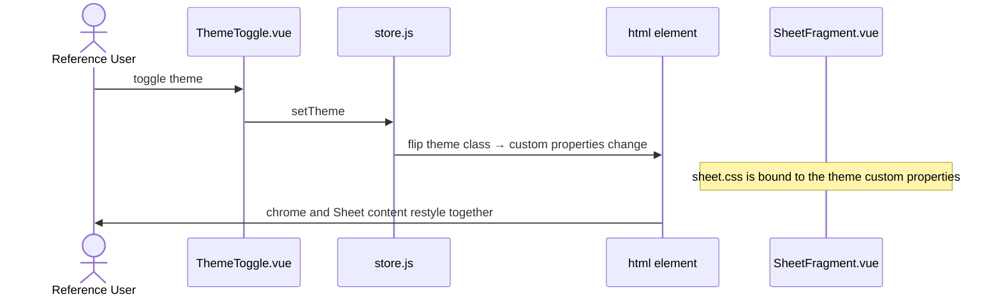

# US-page-view — View a Sheet as a native page

> Context: [View](../view.md)

**As a** `Reference User`, \
**I can** open a `Sheet` and read it as a native page of the website — styled by the site's design system and navigable through its `Table of Contents`, \
**so that** every `Sheet` shares one consistent look and behaviour and my photographic recall is never disturbed by per-Sheet styling drift.

> The **APIs**, **Backend**, and **Microservices** pointer sections are not applicable to any AC in this Story — the app is a static site with no backend ([Master §5](../../hldd.md#5-api)). Each AC gives only its Data Model and Frontend pointers.

## AC-page-view.1 — The `Sheet` renders in the site's design system — Happy Path

```gherkin
Given the `Reference User` opens a `Sheet`,
When its `Fragment` is rendered,
Then the `Fragment` is displayed inline as part of the page, with no isolation boundary around it,
    And its typography, colours, and spacing come from the site's stylesheet,
    And the `Sheet` carries no styling of its own
```

```mermaid
sequenceDiagram
    actor U as Reference User
    participant S as Sheet.vue
    participant C as content.js
    participant SF as SheetFragment.vue
    U->>S: open a Sheet
    S->>C: load sheet.yml + sheet.html
    S->>SF: pass the Fragment
    SF->>U: render inline; sheet.css supplies all typography, colours, spacing
```

### Data Model
- `SubTopic` `Fragment` (`sheet.html`) — content bundle, [Master §4.1](../../hldd.md#41-content-entities); loaded by [content.js](../../../../web/src/lib/content.js).

### Frontend
- [Sheet.vue](../../../../web/src/pages/Sheet.vue) — hosts the `Fragment` as an ordinary page region.
- [SheetFragment.vue](../../../../web/src/components/SheetFragment.vue) *(planned)* — renders the `Fragment` inline as part of the application page.
- [sheet.css](../../../../web/src/styles/sheet.css) *(planned)* — the vocabulary stylesheet; the single source of `Sheet` typography, colours, and spacing.

## AC-page-view.2 — Navigate the `Sheet` via its `Table of Contents` — Happy Path

```gherkin
Given the `Reference User` is viewing a `Sheet`,
    And its `Table of Contents` is derived from the `Fragment`'s sections, not authored separately,
When the `Reference User` activates a `Table of Contents` entry,
Then the page scrolls to that section without a page reload,
    And the application URL's hash routing (`#/topic/subtopic`) is not broken,
    And the entry for the section currently in view is indicated
```

```mermaid
sequenceDiagram
    actor U as Reference User
    participant SF as SheetFragment.vue
    participant R as router.js
    U->>SF: activate a Table of Contents entry
    SF->>SF: scroll to the target section, no reload
    Note over R: hash route #/topic/subtopic left intact
    SF->>SF: scroll-spy observes the section in view
    SF->>U: section shown; its TOC entry indicated
```

### Data Model
- `SubTopic` `Fragment` (`sheet.html`) sections — content bundle, [Master §4.1](../../hldd.md#41-content-entities); the `Table of Contents` is derived at render time and is not stored.

### Frontend
- [SheetFragment.vue](../../../../web/src/components/SheetFragment.vue) *(planned)* — derives the `Table of Contents` from the `Fragment`'s sections; owns scroll-spy and in-page anchor scrolling.
- [router.js](../../../../web/src/router.js) — hash routing the anchor scrolling must coexist with.

## AC-page-view.3 — `Sheet` content follows the active theme — Happy Path

```gherkin
Given the `Reference User` is viewing a `Sheet`,
When the `Reference User` toggles between the Light and Dark themes,
Then the `Sheet` content is restyled together with the application chrome,
    And no part of the `Sheet` keeps colours from the other theme
```

> Theme mechanics themselves belong to [US-dark-mode](us-dark-mode.md); this AC covers the `Sheet` content's participation in the toggle.



### Data Model
- Theme preference key — `localStorage` ([Master §4.2](../../hldd.md#42-runtime-settings-store)).

### Frontend
- [ThemeToggle.vue](../../../../web/src/components/ThemeToggle.vue) / [store.js](../../../../web/src/store.js) — the theme switch.
- [sheet.css](../../../../web/src/styles/sheet.css) *(planned)* — styles the `Fragment` exclusively through the site's theme custom properties, so `Sheet` content follows the flip.
