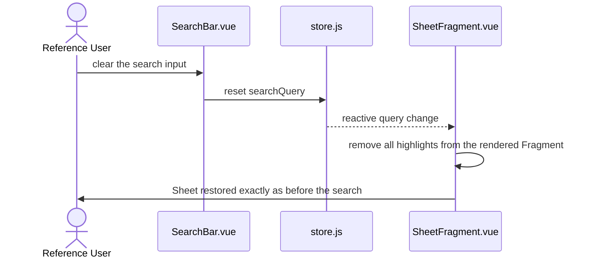

# US-sheet-search — Search within a Sheet

> Context: [View](../view.md)

**As a** `Reference User`, \
**I can** type a search term while viewing a `Sheet` and have every occurrence highlighted in place, \
**so that** I can immediately spot hits without losing the spatial layout my photographic memory relies on.

> The **APIs**, **Backend**, and **Microservices** pointer sections are not applicable to any AC in this Story — the app is a static site with no backend ([Master §5](../../hldd.md#5-api)). Each AC gives only its Data Model and Frontend pointers.

## AC-sheet-search.1 — Highlight matches in place — Happy Path

```gherkin
Given the `Reference User` is viewing a `Sheet` whose rendered content contains the term "model",
When the `Reference User` types "model" into the search input,
Then every occurrence of "model" within the rendered `Sheet` content is visually highlighted in place,
    And the `Sheet`'s layout and spatial structure are unchanged apart from the highlights
```

```mermaid
sequenceDiagram
    actor U as Reference User
    participant SB as SearchBar.vue
    participant ST as store.js
    participant SF as SheetFragment.vue
    U->>SB: type "model"
    SB->>ST: set searchQuery
    ST-->>SF: reactive query change
    SF->>SF: apply highlights to every match in the rendered Fragment
    SF->>U: occurrences highlighted in place; layout unchanged
```

### Data Model
- `SubTopic` `Fragment` (`sheet.html`) — [Master §4.1](../../hldd.md#41-content-entities).
- `searchQuery` — transient runtime state (not persisted), held in [store.js](../../../../web/src/store.js).

### Frontend
- [SearchBar.vue](../../../../web/src/components/SearchBar.vue) — the search input.
- [SheetFragment.vue](../../../../web/src/components/SheetFragment.vue) — renders the `Fragment` and owns highlight application/removal.

## AC-sheet-search.2 — Clear the search — Happy Path

```gherkin
Given the `Reference User` is viewing a `Sheet` with the search term "model" applied and its occurrences highlighted,
When the `Reference User` clears the search input,
Then every highlight is removed,
    And the `Sheet` renders exactly as it did before the search
```



### Data Model
- `SubTopic` `Fragment` (`sheet.html`) — [Master §4.1](../../hldd.md#41-content-entities).
- `searchQuery` — transient runtime state (not persisted), held in [store.js](../../../../web/src/store.js).

### Frontend
- [SearchBar.vue](../../../../web/src/components/SearchBar.vue) — the search input.
- [SheetFragment.vue](../../../../web/src/components/SheetFragment.vue) — renders the `Fragment` and owns highlight application/removal.
